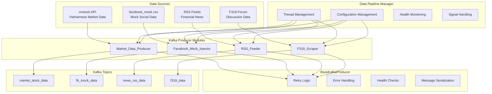
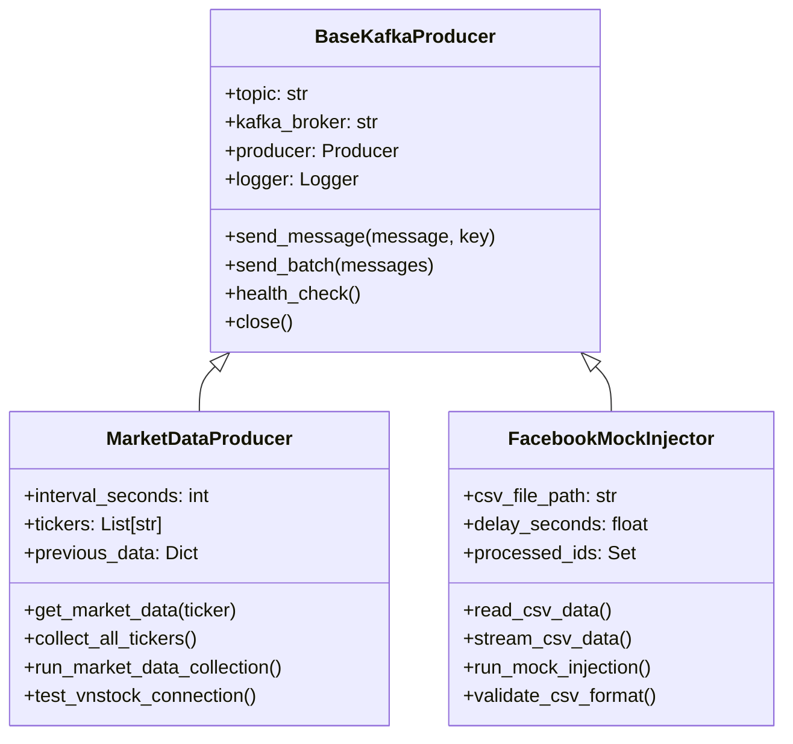

# Design Document: Kafka Producer Modules

## Overview

This design outlines the implementation of two new Kafka producer modules for the existing data pipeline system: **Market_Data_Producer** for Vietnamese stock market data collection and **Facebook_Mock_Injector** for mock social media data streaming. Both modules will inherit from the existing `BaseKafkaProducer` class to ensure consistent error handling, retry logic, and integration patterns.

The modules will extend the current producers system (which already includes RSS feeders and F319 scrapers) with additional data sources essential for financial sentiment analysis. The Market_Data_Producer will provide real-time Vietnamese stock market data using the vnstock library, while the Facebook_Mock_Injector will simulate social media data streams for testing and development purposes.

## Architecture

### System Integration

The new producers integrate into the existing multi-threaded data pipeline architecture managed by `DataPipelineManager`. The system follows a producer-consumer pattern where:

1. **Producers** collect data from various sources
2. **Kafka** acts as the message broker for data distribution
3. **Consumers** (multi-agent system, NLP engine) process the streamed data



### Inheritance Structure

Both new producers inherit from `BaseKafkaProducer`, ensuring consistent behavior:



## Components and Interfaces

### Market_Data_Producer

**Purpose:** Collect Vietnamese stock market data (VNINDEX, VN30) from vnstock library and stream to Kafka.

**Key Components:**
- **Data Collector:** Interfaces with vnstock API to fetch market data
- **Data Parser:** Converts vnstock responses to standardized JSON format  
- **Change Detector:** Compares current data with previous to avoid duplicate sends
- **Scheduler:** Manages collection intervals (default 60 seconds)

**Public Interface:**
```python
class MarketDataProducer(BaseKafkaProducer):
    def __init__(self) -> None
    def get_market_data(self, ticker: str) -> Optional[Dict[str, Any]]
    def collect_all_tickers(self) -> List[Dict[str, Any]]
    def collect_once(self) -> Dict[str, int]
    def run_market_data_collection(self) -> None
    def test_vnstock_connection(self) -> bool
    def get_available_indices(self) -> List[str]
```

**Configuration:**
- `MARKET_DATA_INTERVAL_SECONDS`: Collection interval (default: 60)
- `VNSTOCK_TICKERS`: Comma-separated list of tickers (default: "VNINDEX,VN30")

### Facebook_Mock_Injector

**Purpose:** Stream mock Facebook data from CSV file to simulate social media data for testing.

**Key Components:**
- **CSV Reader:** Reads and validates CSV file structure
- **Data Parser:** Converts CSV rows to JSON format with metadata
- **Stream Simulator:** Implements delays between messages to simulate real-time streaming
- **Loop Controller:** Handles continuous streaming with restart capability

**Public Interface:**
```python
class FacebookMockInjector(BaseKafkaProducer):
    def __init__(self) -> None
    def read_csv_data(self) -> List[Dict[str, Any]]
    def stream_csv_data(self) -> Iterator[Dict[str, Any]]
    def inject_once(self) -> Dict[str, int]
    def run_mock_injection(self, loop_count: int, loop_delay_minutes: int) -> None
    def validate_csv_format(self) -> bool
    def get_csv_info(self) -> Dict[str, Any]
```

**Configuration:**
- `FB_MOCK_FILE_PATH`: Path to CSV file (default: "facebook_mock.csv")
- `FB_MOCK_STREAM_DELAY`: Delay between messages (default: 1.0)

### BaseKafkaProducer Integration

Both producers leverage the shared functionality from `BaseKafkaProducer`:

**Retry Logic:**
- Exponential backoff with configurable attempts (default: 5)
- Automatic retry on `KafkaException`, `ConnectionError`, `OSError`
- Graceful degradation on persistent failures

**Error Handling:**
- Comprehensive logging of all operations and errors
- Specific error types for different failure modes
- Health check integration for monitoring

**Message Delivery:**
- Asynchronous message sending with delivery callbacks
- Batch sending capability for multiple messages
- Message serialization with timestamp injection

## Data Models

### Market Data JSON Schema

```json
{
  "ticker": "VNINDEX",
  "timestamp": "2024-01-15T15:30:00+00:00", 
  "open": 1245.67,
  "high": 1251.23,
  "low": 1242.15,
  "close": 1249.88,
  "volume": 15420000,
  "data_source": "vnstock",
  "collection_timestamp": "2024-01-15T15:31:00+00:00"
}
```

**Field Descriptions:**
- `ticker`: Stock/index symbol (VNINDEX, VN30, etc.)
- `timestamp`: Market data timestamp from source
- `open/high/low/close`: Price values in VND
- `volume`: Trading volume
- `data_source`: Always "vnstock" for identification
- `collection_timestamp`: When data was collected by producer

### Facebook Mock Data JSON Schema

```json
{
  "comment_id": "fb_001",
  "content_text": "Thị trường hôm nay khá tích cực, VN-Index tăng mạnh!",
  "created_at": "2024-01-15T09:30:00+00:00",
  "likes": 15,
  "row_index": 0,
  "stream_index": 0,
  "injection_timestamp": "2024-01-15T16:00:00+00:00",
  "stream_timestamp": "2024-01-15T16:00:01+00:00"
}
```

**Field Descriptions:**
- `comment_id`: Unique identifier from CSV
- `content_text`: Comment content in Vietnamese
- `created_at`: Original creation timestamp from CSV
- `likes`: Engagement metric from CSV
- `row_index`: CSV row number for tracking
- `stream_index`: Position in current streaming session
- `injection_timestamp`: When record was processed
- `stream_timestamp`: When record was streamed

### CSV File Format

The `facebook_mock.csv` file must contain these columns:

| Column | Type | Description | Example |
|--------|------|-------------|---------|
| comment_id | string | Unique identifier | "fb_001" |
| content_text | string | Vietnamese text content | "Thị trường tăng mạnh!" |
| created_at | datetime | Creation timestamp | "2024-01-15 09:30:00" |
| likes | integer | Number of likes | 15 |

## Correctness Properties

*A property is a characteristic or behavior that should hold true across all valid executions of a system-essentially, a formal statement about what the system should do. Properties serve as the bridge between human-readable specifications and machine-verifiable correctness guarantees.*

### Property 1: Market Data JSON Format Consistency

*For any* market data collected from vnstock, the JSON output SHALL contain all required fields (ticker, timestamp, open, high, low, close, volume, data_source, collection_timestamp) with correct data types

**Validates: Requirements 1.4**

### Property 2: Error Handling Consistency

*For any* error condition encountered by either producer, the system SHALL consistently apply BaseKafkaProducer retry logic and error handling mechanisms

**Validates: Requirements 1.6, 2.8, 4.1**

### Property 3: Logging Coverage Completeness

*For any* operation performed by either producer (success or failure), appropriate log entries SHALL be generated with consistent format and detail level

**Validates: Requirements 1.7, 4.2, 4.3, 4.6**

### Property 4: CSV to JSON Transformation

*For any* valid CSV row with required columns, the Facebook_Mock_Injector SHALL convert it to JSON format preserving all data while adding required metadata fields

**Validates: Requirements 2.4**

### Property 5: CSV Format Validation

*For any* CSV file provided to Facebook_Mock_Injector, the validation SHALL correctly identify whether all required columns (comment_id, content_text, created_at, likes) are present

**Validates: Requirements 2.3**

### Property 6: Health Check Specificity

*For any* health check failure condition, the system SHALL provide specific error information in logs that identifies the root cause

**Validates: Requirements 5.6**

## Error Handling

### Market_Data_Producer Error Scenarios

**vnstock API Failures:**
- Connection timeout: Retry with exponential backoff
- Invalid response: Log warning, skip current cycle
- API rate limiting: Implement respectful delays
- Data parsing errors: Log error details, continue with next ticker

**Implementation:**
```python
@retry(stop=stop_after_attempt(5), wait=wait_exponential(multiplier=1, min=2, max=10))
def get_market_data(self, ticker: str) -> Optional[Dict[str, Any]]:
    try:
        # vnstock API call
        df = stock.stock_historical_data(...)
        return self._parse_market_record(df.iloc[0], ticker)
    except Exception as e:
        self.logger.error(f"Error fetching market data for {ticker}: {e}")
        raise  # Let retry decorator handle it
```

**Data Validation Errors:**
- Invalid price data (negative, zero): Log warning, skip record
- Missing timestamps: Use current time as fallback
- Volume data issues: Default to 0, log warning

### Facebook_Mock_Injector Error Scenarios

**File System Errors:**
- Missing CSV file: Create sample file, log info message
- Corrupted CSV: Log detailed error, terminate gracefully
- Permission issues: Log specific error, suggest solutions
- Encoding problems: Try multiple encodings, fallback to UTF-8

**Implementation:**
```python
def read_csv_data(self) -> List[Dict[str, Any]]:
    try:
        df = pd.read_csv(self.csv_file_path, encoding='utf-8')
    except UnicodeDecodeError:
        for encoding in ['utf-8-sig', 'cp1252', 'latin1']:
            try:
                df = pd.read_csv(self.csv_file_path, encoding=encoding)
                self.logger.info(f"Successfully read CSV with {encoding} encoding")
                break
            except:
                continue
        else:
            raise ValueError("Could not read CSV with any supported encoding")
```

**Data Processing Errors:**
- Invalid datetime formats: Try multiple parsers, fallback to current time
- Missing required columns: Log error, provide specific missing column names
- Empty CSV file: Log warning, suggest sample data creation

### Shared Error Handling (BaseKafkaProducer)

Both producers inherit robust error handling from `BaseKafkaProducer`:

**Kafka Connection Errors:**
- Broker unavailable: Retry connection with exponential backoff
- Topic not found: Log error with topic name, suggest topic creation
- Authentication failures: Log specific auth error, check configuration

**Message Delivery Errors:**
- Serialization failures: Log message structure, provide format guidance
- Timeout errors: Increase timeout, retry with backoff
- Partition errors: Log partition details, continue with default partition

## Testing Strategy

### Dual Testing Approach

The testing strategy combines unit tests for specific behaviors with property-based tests for comprehensive coverage:

**Unit Tests Focus:**
- Class inheritance verification (isinstance checks)
- Environment variable configuration
- Mock integrations with external dependencies
- Specific error handling scenarios
- Health check implementations

**Property Tests Focus:**
- Data format consistency across various inputs
- Error handling consistency across failure types
- Logging completeness for all operations
- CSV parsing robustness with diverse file formats

### Property-Based Testing Configuration

Using Hypothesis for Python property-based testing:
- **Minimum 100 iterations** per property test
- **Custom generators** for market data and CSV structures
- **Tagged test references** to design properties

**Example Property Test:**
```python
from hypothesis import given, strategies as st

@given(st.dictionaries(
    st.sampled_from(['open', 'high', 'low', 'close', 'volume']),
    st.floats(min_value=0.01, max_value=10000.0),
    min_size=5, max_size=5
))
def test_market_data_json_format_consistency(self, market_data):
    """Feature: kafka-producer-modules, Property 1: Market Data JSON Format Consistency"""
    producer = MarketDataProducer()
    result = producer._parse_market_record(market_data, "VNINDEX")
    
    required_fields = ['ticker', 'timestamp', 'open', 'high', 'low', 'close', 'volume', 'data_source', 'collection_timestamp']
    assert all(field in result for field in required_fields)
    assert isinstance(result['close'], (int, float))
    assert result['data_source'] == 'vnstock'
```

### Test Categories

**Market_Data_Producer Tests:**
- vnstock connection mocking and simulation
- Market data parsing with various data structures
- Change detection logic with different data sets
- Collection scheduling and interval management
- Error recovery from API failures

**Facebook_Mock_Injector Tests:**
- CSV file creation and validation
- Multiple encoding support testing
- Streaming delay verification
- Loop restart and continuation behavior
- Malformed data handling

**Integration Tests:**
- DataPipelineManager integration
- Concurrent producer execution  
- Kafka message delivery verification
- Health check coordination
- Signal handling and graceful shutdown

### Testing Dependencies

**Required Test Dependencies:**
```
pytest>=7.0.0
hypothesis>=6.0.0
pytest-mock>=3.6.0
pytest-asyncio>=0.21.0
```

**Mock Strategies:**
- **vnstock API**: Mock responses with realistic market data
- **Kafka Producer**: Mock message delivery and error conditions
- **File System**: Mock CSV file operations and permissions
- **Time/Scheduling**: Mock sleep and interval functions for fast testing