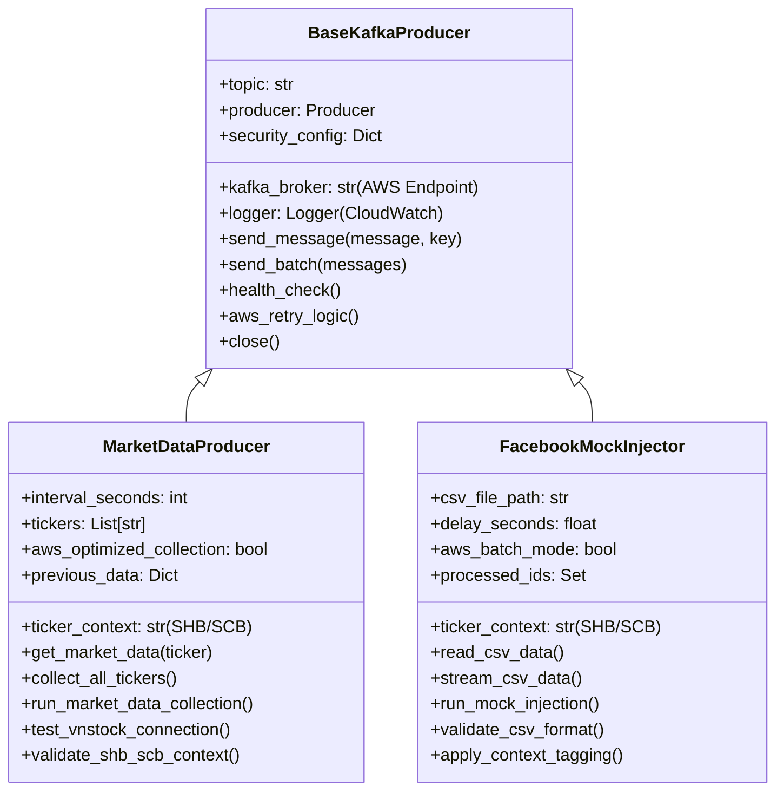

# Design Document: Kafka Producer Modules

## Overview

This design outlines the implementation of two specialized Kafka producer modules optimized for AWS t3.large infrastructure: **Market_Data_Producer** for Vietnamese stock market data collection and **Facebook_Mock_Injector** for mock social media data streaming. Both modules inherit from the existing `BaseKafkaProducer` class to ensure consistent error handling, retry logic, and integration patterns specifically tailored for AWS cloud deployment.

The modules extend the current producers system with additional data sources essential for financial sentiment analysis supporting two distinct case study frameworks: **SHB (Standard Baseline)** covering normal market periods (01/01/2026 to 01/06/2026), and **SCB (Systemic Crisis Event)** covering crisis periods (01/09/2022 to 31/12/2022). The Market_Data_Producer provides real-time Vietnamese stock market data using the vnstock library, while the Facebook_Mock_Injector simulates social media data streams for comprehensive testing scenarios.

The system is specifically designed to operate within AWS t3.large instance specifications (2 vCPU, 8GB RAM) and integrates seamlessly with the four core Kafka topics: `news_rss_data`, `f319_data`, `fb_mock_data`, and `market_stock_data`.

## Architecture

### AWS Cloud Integration

The producer modules are architected for native AWS deployment, leveraging t3.large instance specifications for optimal performance:

```mermaid
graph TB
    subgraph "AWS t3.large Instance (2 vCPU, 8GB RAM)"
        subgraph "Data Sources"
            A[vnstock API<br/>Vietnamese Market Data]
            B[facebook_mock.csv<br/>Mock Social Data]
            C[RSS Feeds<br/>Financial News]
            D[F319 Forum<br/>Discussion Data]
        end

        subgraph "Kafka Producer Modules"
            E[Market_Data_Producer<br/>SHB/SCB Context]
            F[Facebook_Mock_Injector<br/>SHB/SCB Context] 
            G[RSS_Feeder]
            H[F319_Scraper]
        end

        subgraph "BaseKafkaProducer (AWS Optimized)"
            I[AWS Kafka Connection<br/>Port 9092]
            J[Exponential Backoff Retry]
            K[CloudWatch Integration]
            L[Standard_JSON Serialization]
        end

        subgraph "Four Core Kafka Topics"
            M[market_stock_data<br/>Single Partition]
            N[fb_mock_data<br/>Single Partition]
            O[news_rss_data<br/>Single Partition]
            P[f319_data<br/>Single Partition]
        end
    end

    subgraph "AWS Infrastructure Services"
        Q[Kafka Broker<br/>KAFKA_HEAP_OPTS="-Xmx2G -Xms2G"]
        R[ChromaDB Service<br/>Port 8000]
        S[Security Groups<br/>Ports 22, 8000, 9092]
        T[EBS Storage<br/>Persistent Volumes]
    end

    A --> E
    B --> F
    C --> G
    D --> H

    E --> I
    F --> I
    G --> I
    H --> I

    E --> M
    F --> N
    G --> O
    H --> P

    M --> Q
    N --> Q
    O --> Q
    P --> Q

    Q --> R
    Q --> T
    S --> Q
    S --> R
```

### Case Study Framework Integration

The system supports two distinct analytical frameworks with proper ticker context tagging:

**SHB (Standard Baseline) - Normal Market Period:**
- Timeline: 01/01/2026 to 01/06/2026
- Ticker Context: `"SHB"`
- Purpose: Establish mathematical baseline against market volatility
- Data Sources: VNINDEX baseline data, normal social sentiment

**SCB (Systemic Crisis Event) - Crisis Period:**
- Timeline: 01/09/2022 to 31/12/2022  
- Ticker Context: `"SCB"`
- Purpose: Analyze systemic contagion patterns
- Data Sources: VNINDEX/STB crisis proxies, crisis social sentiment

### Producer Architecture Pattern



## Components and Interfaces

### Market_Data_Producer (AWS Optimized)

**Purpose:** Collect Vietnamese stock market data optimized for AWS t3.large infrastructure with SHB/SCB context tagging.

**AWS-Specific Optimizations:**
- **Memory Management:** Configured for t3.large 8GB RAM with optimized data caching
- **Network Optimization:** AWS-specific connection pooling for vnstock API calls
- **Context-Aware Collection:** Automatic SHB/SCB context tagging based on timeline
- **CloudWatch Integration:** Direct integration with AWS monitoring services

**Public Interface:**
```python
class MarketDataProducer(BaseKafkaProducer):
    def __init__(self, ticker_context: str = "SHB") -> None
    def get_market_data(self, ticker: str) -> Optional[Dict[str, Any]]
    def collect_all_tickers(self) -> List[Dict[str, Any]]
    def collect_once(self) -> Dict[str, int]
    def run_market_data_collection(self) -> None
    def test_vnstock_connection(self) -> bool
    def get_available_indices(self) -> List[str]
    def validate_shb_scb_context(self) -> bool
    def get_aws_health_metrics(self) -> Dict[str, Any]
```

**AWS-Optimized Configuration:**
- `MARKET_DATA_INTERVAL_SECONDS`: Collection interval optimized for t3.large (default: 60)
- `VNSTOCK_TICKERS`: Context-aware ticker list (default: "VNINDEX,VN30,STB")
- `TICKER_CONTEXT`: SHB or SCB context (default: "SHB")
- `AWS_KAFKA_ENDPOINT`: AWS-specific Kafka broker endpoint
- `AWS_MEMORY_OPTIMIZATION`: Enable t3.large memory optimization (default: true)

### Facebook_Mock_Injector (AWS Enhanced)

**Purpose:** Stream mock Facebook data with SHB/SCB context tagging, optimized for AWS deployment.

**AWS-Specific Features:**
- **Batch Processing:** Optimized batch mode for AWS instance performance
- **Context Injection:** Automatic SHB/SCB context tagging in JSON payloads
- **EBS Integration:** Optimized CSV file reading from AWS EBS storage
- **CloudWatch Metrics:** Real-time streaming metrics to CloudWatch

**Public Interface:**
```python
class FacebookMockInjector(BaseKafkaProducer):
    def __init__(self, ticker_context: str = "SHB") -> None
    def read_csv_data(self) -> List[Dict[str, Any]]
    def stream_csv_data(self) -> Iterator[Dict[str, Any]]
    def inject_once(self) -> Dict[str, int]
    def run_mock_injection(self, loop_count: int, loop_delay_minutes: int) -> None
    def validate_csv_format(self) -> bool
    def get_csv_info(self) -> Dict[str, Any]
    def apply_context_tagging(self, data: Dict[str, Any]) -> Dict[str, Any]
    def get_aws_batch_metrics(self) -> Dict[str, Any]
```

**AWS-Enhanced Configuration:**
- `FB_MOCK_FILE_PATH`: EBS-optimized path (default: "/data/facebook_mock.csv")
- `FB_MOCK_STREAM_DELAY`: AWS-optimized delay (default: 1.0)
- `TICKER_CONTEXT`: SHB or SCB context (default: "SHB")
- `AWS_BATCH_SIZE`: Batch processing size for t3.large (default: 100)
- `AWS_EBS_OPTIMIZATION`: Enable EBS read optimization (default: true)

### BaseKafkaProducer AWS Integration

Enhanced with AWS-specific capabilities:

**AWS Connection Management:**
- Dynamic AWS Kafka broker endpoint resolution
- AWS Security Group compliance for port 9092
- AWS Elastic IP binding for KAFKA_ADVERTISED_LISTENERS
- IAM role-based authentication support

**AWS Error Handling:**
- AWS-specific retry logic with exponential backoff
- CloudWatch error logging integration
- AWS network failure detection and recovery
- EBS storage failure resilience

**AWS Monitoring Integration:**
- CloudWatch metrics publishing
- AWS health check integration
- Performance metrics for t3.large optimization
- Cost optimization tracking

## Data Models

### Market Data JSON Schema (AWS Enhanced)

```json
{
  "ticker": "VNINDEX",
  "timestamp": "2024-01-15T15:30:00+00:00", 
  "open": 1245.67,
  "high": 1251.23,
  "low": 1242.15,
  "close": 1249.88,
  "volume": 15420000,
  "data_source": "vnstock",
  "collection_timestamp": "2024-01-15T15:31:00+00:00",
  "ticker_context": "SHB",
  "aws_instance_id": "i-1234567890abcdef0",
  "processing_metrics": {
    "memory_usage_mb": 256,
    "cpu_usage_percent": 15.2,
    "network_latency_ms": 45
  }
}
```

**Enhanced Field Descriptions:**
- `ticker_context`: Either "SHB" (Standard Baseline) or "SCB" (Systemic Crisis Event)
- `aws_instance_id`: AWS EC2 instance identifier for tracking
- `processing_metrics`: t3.large performance metrics for optimization

### Facebook Mock Data JSON Schema (Context-Enhanced)

```json
{
  "comment_id": "fb_001",
  "content_text": "Thị trường hôm nay khá tích cực, VN-Index tăng mạnh!",
  "created_at": "2024-01-15T09:30:00+00:00",
  "likes": 15,
  "row_index": 0,
  "stream_index": 0,
  "injection_timestamp": "2024-01-15T16:00:00+00:00",
  "stream_timestamp": "2024-01-15T16:00:01+00:00",
  "ticker_context": "SHB",
  "sentiment_period": "standard_baseline",
  "aws_batch_id": "batch_001",
  "processing_metrics": {
    "memory_usage_mb": 128,
    "batch_processing_time_ms": 250,
    "ebs_read_time_ms": 12
  }
}
```

**Context-Specific Field Descriptions:**
- `ticker_context`: "SHB" for normal periods, "SCB" for crisis periods
- `sentiment_period`: Human-readable period description
- `aws_batch_id`: AWS batch processing identifier
- `processing_metrics`: AWS-specific performance tracking

### CSV File Format (Context-Aware)

The `facebook_mock.csv` file structure for SHB/SCB scenarios:

| Column | Type | Description | SHB Example | SCB Example |
|--------|------|-------------|-------------|-------------|
| comment_id | string | Unique identifier | "shb_001" | "scb_001" |
| content_text | string | Vietnamese sentiment text | "Thị trường ổn định" | "Thị trường sụp đổ!" |
| created_at | datetime | Context-appropriate timestamp | "2026-01-15 09:30:00" | "2022-09-15 14:45:00" |
| likes | integer | Engagement metric | 15 | 143 |
| period_context | string | SHB or SCB indicator | "SHB" | "SCB" |

## Correctness Properties

*A property is a characteristic or behavior that should hold true across all valid executions of a system-essentially, a formal statement about what the system should do. Properties serve as the bridge between human-readable specifications and machine-verifiable correctness guarantees.*

### Property 1: AWS Kafka Broker Connection Consistency

*For any* environment configuration provided to Market_Data_Producer or Facebook_Mock_Injector, the system SHALL successfully establish AWS Kafka broker connections on port 9092 when configuration is valid

**Validates: Requirements 1.2, 2.1**

### Property 2: Standard JSON Format Consistency

*For any* market data collected from vnstock or CSV data processed by Facebook_Mock_Injector, the JSON output SHALL contain all required Standard_JSON fields with correct data types and proper ticker_context tagging

**Validates: Requirements 1.5, 2.4**

### Property 3: SHB/SCB Context Tagging Completeness

*For any* data message published by either producer, the JSON payload SHALL contain explicit ticker_context field set to either "SHB" or "SCB" based on configured context

**Validates: Requirements 1.5, 2.4**

### Property 4: AWS Health Check Accuracy

*For any* connection state (successful or failed), the health check methods SHALL return accurate boolean responses reflecting actual AWS Kafka broker and external API connectivity status

**Validates: Requirements 6.1, 6.2, 6.3**

### Property 5: CSV Validation and Error Handling Consistency

*For any* CSV file state (valid, missing, corrupted, wrong permissions), the Facebook_Mock_Injector SHALL consistently apply validation logic and appropriate error handling responses

**Validates: Requirements 2.2, 3.2, 3.3, 5.3**

### Property 6: Retry Mechanism Reliability

*For any* AWS network failure scenario (timeout, connection error, broker unavailable), the system SHALL consistently apply exponential backoff retry mechanisms with proper failure recovery

**Validates: Requirements 5.1, 5.2**

### Property 7: Configuration Parameter Handling

*For any* configuration scenario (complete, missing parameters, invalid values), the system SHALL handle parameters consistently using documented default values when appropriate

**Validates: Requirements 4.3, 4.4**

### Property 8: Logging Completeness and Format Consistency

*For any* system operation (success, failure, warning), the logging output SHALL maintain consistent format with complete processing metrics suitable for AWS CloudWatch integration

**Validates: Requirements 3.4, 5.4, 6.3**

## Error Handling

### AWS-Optimized Error Handling

**Market_Data_Producer AWS-Specific Errors:**

**AWS Kafka Connection Failures:**
- Connection timeout to AWS broker: Implement AWS-specific exponential backoff
- Security Group restrictions: Log specific port/IP details with resolution guidance
- IAM permission issues: Provide detailed AWS credential troubleshooting steps
- KAFKA_ADVERTISED_LISTENERS binding failures: Dynamic Elastic IP resolution

```python
@retry(
    stop=stop_after_attempt(5), 
    wait=wait_exponential(multiplier=2, min=4, max=60),
    retry=retry_if_exception_type((KafkaException, ConnectionError, OSError))
)
def establish_aws_kafka_connection(self) -> bool:
    try:
        # AWS-specific Kafka connection logic
        self.producer = Producer({
            'bootstrap.servers': self.aws_kafka_endpoint,
            'security.protocol': 'PLAINTEXT',  # or SASL_SSL for production
            'client.id': f'{self.aws_instance_id}-market-producer'
        })
        return True
    except Exception as e:
        self.logger.error(f"AWS Kafka connection failed: {e}")
        if "security.group" in str(e).lower():
            self.logger.error("Check AWS Security Group allows port 9092")
        raise
```

**vnstock API Integration Errors:**
- API rate limiting: Implement respectful delays with AWS CloudWatch monitoring
- Vietnamese market hours: Time-zone aware collection scheduling
- Data parsing errors: Enhanced logging with Vietnamese text handling

**AWS Resource Optimization Errors:**
- Memory pressure on t3.large: Automatic data caching optimization
- CPU utilization warnings: Collection interval auto-adjustment
- EBS I/O throttling: Optimized file access patterns

### Facebook_Mock_Injector AWS Error Handling

**EBS Storage Integration Errors:**
- EBS volume not mounted: Detailed mount troubleshooting guidance
- EBS I/O performance issues: Automatic batch size adjustment
- CSV file corruption detection: Enhanced validation with recovery suggestions

```python
def read_csv_with_aws_optimization(self) -> List[Dict[str, Any]]:
    try:
        # EBS-optimized CSV reading
        df = pd.read_csv(
            self.csv_file_path, 
            encoding='utf-8',
            chunksize=self.aws_batch_size if self.aws_batch_mode else None
        )
        
        if self.aws_batch_mode:
            # Process in batches for t3.large memory optimization
            processed_data = []
            for chunk in df:
                processed_data.extend(self.process_csv_chunk(chunk))
            return processed_data
        else:
            return self.process_csv_chunk(df)
            
    except pd.errors.EmptyDataError:
        self.logger.warning("Empty CSV file detected, creating sample data")
        self.create_sample_csv_file()
        raise
    except Exception as e:
        self.logger.error(f"AWS EBS CSV read error: {e}")
        if "permission denied" in str(e).lower():
            self.logger.error("Check EBS volume permissions and mount status")
        raise
```

**Context Tagging Errors:**
- Invalid ticker_context values: Automatic validation and correction
- Missing context in CSV data: Intelligent context inference from timestamps
- Context mismatch warnings: Detailed logging with resolution suggestions

### Shared AWS Infrastructure Error Handling

**AWS Network and Security Errors:**
- Security Group misconfiguration: Automated port and IP validation
- VPC connectivity issues: Enhanced networking diagnostics
- Elastic IP binding problems: Dynamic endpoint resolution

**AWS Monitoring and Logging Errors:**
- CloudWatch integration failures: Fallback to local logging with sync retry
- Metrics publishing errors: Batch metrics with error recovery
- Log retention policy conflicts: Automatic policy adjustment recommendations

## Testing Strategy

### AWS Cloud Testing Approach

The testing strategy is specifically designed for AWS t3.large deployment with comprehensive cloud integration validation:

**Unit Tests Focus:**
- AWS configuration validation and environment setup
- SHB/SCB context tagging verification
- t3.large resource optimization validation
- AWS Security Group compliance testing
- CloudWatch integration verification

**Property Tests Focus:**
- AWS connection reliability across various network conditions
- Data format consistency with ticker_context requirements
- Error handling consistency for AWS-specific failure scenarios
- Resource utilization optimization across different data loads

### Property-Based Testing Configuration

Enhanced for AWS deployment with comprehensive cloud scenario coverage:

**AWS-Specific Test Generators:**
```python
import hypothesis.strategies as st
from hypothesis import given

@st.composite
def aws_environment_configs(draw):
    """Generate various AWS environment configurations"""
    return {
        'AWS_KAFKA_ENDPOINT': draw(st.sampled_from([
            'localhost:9092',
            'kafka.us-east-1.amazonaws.com:9092',
            'invalid-endpoint'
        ])),
        'TICKER_CONTEXT': draw(st.sampled_from(['SHB', 'SCB', 'INVALID'])),
        'AWS_INSTANCE_ID': draw(st.text(min_size=10, max_size=20)),
        'AWS_MEMORY_OPTIMIZATION': draw(st.booleans())
    }

@given(aws_environment_configs())
def test_aws_kafka_connection_consistency(self, config):
    """Feature: kafka-producer-modules, Property 1: AWS Kafka Broker Connection Consistency"""
    producer = MarketDataProducer()
    producer.configure_aws_environment(config)
    
    if config['AWS_KAFKA_ENDPOINT'] != 'invalid-endpoint':
        assert producer.establish_aws_kafka_connection() == True
    else:
        with pytest.raises((ConnectionError, KafkaException)):
            producer.establish_aws_kafka_connection()
```

**SHB/SCB Context Testing:**
```python
@st.composite
def market_data_with_context(draw):
    """Generate market data with SHB/SCB context"""
    context = draw(st.sampled_from(['SHB', 'SCB']))
    return {
        'ticker': draw(st.sampled_from(['VNINDEX', 'VN30', 'STB'])),
        'open': draw(st.floats(min_value=1.0, max_value=5000.0)),
        'high': draw(st.floats(min_value=1.0, max_value=5000.0)),
        'low': draw(st.floats(min_value=1.0, max_value=5000.0)),
        'close': draw(st.floats(min_value=1.0, max_value=5000.0)),
        'volume': draw(st.integers(min_value=0, max_value=100000000)),
        'ticker_context': context
    }

@given(market_data_with_context())
def test_shb_scb_context_tagging(self, market_data):
    """Feature: kafka-producer-modules, Property 3: SHB/SCB Context Tagging Completeness"""
    producer = MarketDataProducer(ticker_context=market_data['ticker_context'])
    json_output = producer._parse_market_record(market_data, market_data['ticker'])
    
    assert 'ticker_context' in json_output
    assert json_output['ticker_context'] in ['SHB', 'SCB']
    assert json_output['ticker_context'] == market_data['ticker_context']
```

### AWS Integration Testing Categories

**AWS Infrastructure Tests:**
- t3.large resource utilization validation
- EBS storage integration and performance testing
- Security Group configuration compliance
- CloudWatch metrics integration verification
- AWS network failure simulation and recovery testing

**SHB/SCB Scenario Tests:**
- Standard Baseline period data collection accuracy
- Systemic Crisis Event data pattern recognition
- Context switching between SHB and SCB modes
- Historical timeline data accuracy validation

**Performance Optimization Tests:**
- Memory usage optimization on t3.large instances
- CPU utilization monitoring and adjustment
- Network latency optimization for AWS deployment
- Batch processing efficiency for large datasets

### Testing Dependencies for AWS Deployment

**Enhanced Test Dependencies:**
```
pytest>=7.0.0
hypothesis>=6.0.0
pytest-mock>=3.6.0
pytest-asyncio>=0.21.0
moto>=4.0.0  # AWS mocking
boto3>=1.26.0  # AWS SDK
docker>=6.0.0  # Container testing
pytest-cov>=4.0.0  # Coverage reporting
```

**AWS Mock Strategies:**
- **AWS Services**: Mock Kafka, CloudWatch, EBS using moto library
- **Network Conditions**: Simulate various AWS network failure scenarios
- **Resource Constraints**: Mock t3.large resource limitations
- **Time/Timeline**: Mock SHB/SCB historical period data
- **Vietnamese Market Data**: Mock vnstock API responses with realistic data

**Continuous Integration for AWS:**
- Automated testing on AWS CodeBuild with t3.large simulation
- Integration testing with actual AWS services in staging environment
- Performance benchmarking against t3.large resource specifications
- Security testing for AWS Security Group compliance