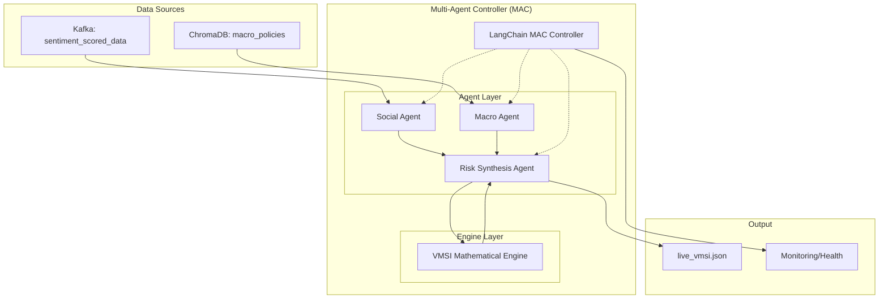

# Design Document

## Overview

The Multi-Agent Controller (MAC) and VMSI Mathematical Engine is a sophisticated financial sentiment analysis system designed to process real-time social media and macroeconomic data. The system orchestrates multiple specialized agents using [LangChain's multi-agent framework](https://blog.langchain.com/langgraph-multi-agent-workflows/), implementing a sequential workflow pattern to calculate the Vietnam Market Sentiment Index (VMSI) and provide automated risk alerts.

### System Architecture Vision

The system follows a modular agent-based architecture where each agent has a specific responsibility:
- **VMSI Engine**: Pure mathematical computation engine for index calculation
- **Social Agent**: Processes sentiment-scored social media data from Kafka
- **Macro Agent**: Analyzes macroeconomic policies using semantic search
- **Risk Synthesis Agent**: Orchestrates final computation and risk assessment
- **MAC System**: LangChain-based controller coordinating all agents

The design prioritizes reliability, performance, and maintainability by implementing circuit breaker patterns, exponential backoff retry strategies, and comprehensive error handling throughout the data pipeline.

## Architecture

### High-Level System Architecture



### Agent Communication Flow

The system implements a sequential workflow with the following data flow:

1. **Initialization Phase**: MAC System initializes all agents and validates connections
2. **Data Acquisition Phase**: Social Agent consumes from Kafka, Macro Agent queries ChromaDB
3. **Processing Phase**: Both agents process data concurrently when possible
4. **Synthesis Phase**: Risk Synthesis Agent receives results and computes final VMSI
5. **Output Phase**: System outputs results to JSON file with risk assessment

### Resilience Patterns

The architecture implements multiple resilience patterns:
- **Circuit Breaker Pattern**: For external service calls (Kafka, ChromaDB)
- **Exponential Backoff**: For retry mechanisms
- **Graceful Degradation**: System continues with partial data when components fail
- **Health Monitoring**: Each component exposes health status

## Components and Interfaces

### 1. VMSI Mathematical Engine

**Purpose**: Pure computation engine implementing VMSI mathematical formulas

**Key Interfaces**:
```python
class VMSIEngine:
    def calculate_social_score(self, 
                              phobert_scores: np.ndarray,
                              interaction_weights: np.ndarray, 
                              credibility_factors: np.ndarray) -> float
    
    def calculate_macro_score(self, s_nhnn: float, s_news: float) -> float
    
    def calculate_raw_index(self, s_macro: float, s_social: float) -> float
    
    def calculate_final_vmsi(self, i_raw: float) -> float
    
    def apply_ema_smoothing(self, current_vmsi: float, previous_vmsi: float) -> float
```

**Implementation Details**:
- Uses numpy arrays for vectorized calculations
- Implements input validation for all mathematical operations
- Handles edge cases (negative values, zero interactions)
- Provides precise floating-point arithmetic with error handling

### 2. Social Agent

**Purpose**: Kafka consumer for sentiment-scored social media data

**Key Interfaces**:
```python
class SocialAgent:
    def consume_sentiment_data(self) -> Dict[str, Any]
    
    def extract_phobert_scores(self, message_payload: Dict) -> np.ndarray
    
    def calculate_interaction_weights(self, social_data: Dict) -> np.ndarray
    
    def process_social_metrics(self) -> float  # Returns S_social(t)
```

**Integration Points**:
- Connects to existing Kafka topic `sentiment_scored_data`
- Uses confluent-kafka library for consistency with existing infrastructure
- Implements dead letter queue for failed message processing
- Provides processing statistics and health monitoring

### 3. Macro Agent

**Purpose**: ChromaDB-based policy analysis and scoring

**Key Interfaces**:
```python
class MacroAgent:
    def query_nhnn_policies(self, similarity_threshold: float = 0.7) -> List[Document]
    
    def analyze_policy_sentiment(self, policies: List[Document]) -> Tuple[int, str, float]
    
    def generate_policy_summary(self, policy_text: str) -> str
    
    def get_macro_score(self) -> Dict[str, Any]  # Returns S_nhnn, summary, confidence
```

**Integration Points**:
- Connects to existing ChromaDB collection `macro_policies`
- Implements semantic similarity search with configurable thresholds
- Uses connection pooling for performance optimization
- Provides Vietnamese language policy summaries

### 4. Risk Synthesis Agent

**Purpose**: Orchestrates final VMSI calculation and risk assessment

**Key Interfaces**:
```python
class RiskSynthesisAgent:
    def receive_social_score(self, s_social: float) -> None
    
    def receive_macro_score(self, s_nhnn: float, metadata: Dict) -> None
    
    def compute_final_vmsi(self) -> float
    
    def assess_risk_level(self, vmsi_smoothed: float) -> Dict[str, Any]
    
    def generate_vietnamese_warning(self, risk_level: str) -> str
    
    def save_output_json(self, results: Dict) -> bool
```

**Risk Assessment Logic**:
- VMSI ≤ 20: High Risk (Negative sentiment warning)
- VMSI ≥ 81: High Risk (Excessive optimism warning)  
- 20 < VMSI < 81: Normal Range
- Uses LLM for Vietnamese warning text generation

### 5. LangChain Multi-Agent Controller (MAC)

**Purpose**: Central orchestration and coordination of all agents

**Key Interfaces**:
```python
class MACSystem:
    def initialize_agents(self) -> bool
    
    def execute_sequential_workflow(self) -> Dict[str, Any]
    
    def handle_agent_failure(self, agent_name: str, error: Exception) -> None
    
    def get_system_health(self) -> Dict[str, str]
    
    def shutdown_gracefully(self) -> None
```

**Orchestration Features**:
- Implements LangChain agent framework for coordination
- Supports parallel execution of Social and Macro agents when possible
- Provides configurable timeouts (default 30 seconds per agent)
- Exposes health check endpoint for monitoring

## Data Models

### Input Data Models

**Social Media Message (from Kafka)**:
```json
{
  "sentiment": {
    "label": "Positive|Negative|Neutral",
    "confidence": 0.85,
    "all_scores": [{"label": "Positive", "confidence": 0.85}]
  },
  "interactions": {
    "likes": 150,
    "shares": 23,
    "comments": 47
  },
  "metadata": {
    "source": "f319_data|fb_mock_data",
    "timestamp": "2024-01-15T10:30:00Z",
    "credibility_score": 0.7
  }
}
```

**Policy Document (from ChromaDB)**:
```json
{
  "content": "Policy text content...",
  "metadata": {
    "doc_name": "nhnn_policy_2024_01.pdf",
    "upload_time": "2024-01-10T08:00:00Z",
    "chunk_id": "policy_001_chunk_01",
    "confidence": 0.82
  }
}
```

### Internal Data Models

**VMSI Calculation Intermediate Results**:
```python
@dataclass
class VMSICalculationData:
    s_social: float          # Social score component
    s_nhnn: float           # NHNN policy score (-1, 0, 1)
    s_news: float           # News sentiment score
    s_macro: float          # Macro score (0.7 × S_nhnn + 0.3 × S_news)
    i_raw: float            # Raw index (0.6 × S_macro + 0.4 × S_social)
    vmsi_current: float     # Current VMSI (50 × (I_raw + 1))
    vmsi_smoothed: float    # EMA smoothed VMSI
    processing_timestamp: datetime
```

### Output Data Models

**Live VMSI Output (live_vmsi.json)**:
```json
{
  "vmsi_value": 67.5,
  "timestamp": "2024-01-15T10:30:00Z",
  "status": "normal|risk_low|risk_high",
  "risk_warning": "Vietnamese risk assessment text...",
  "component_scores": {
    "s_social": 0.15,
    "s_macro": 0.25,
    "s_nhnn": 1,
    "confidence": 0.78
  },
  "processing_metadata": {
    "processing_time": 8.2,
    "agent_versions": {
      "social_agent": "1.0.0",
      "macro_agent": "1.0.0", 
      "risk_agent": "1.0.0"
    },
    "data_sources": {
      "kafka_messages_processed": 1247,
      "policies_analyzed": 5
    }
  }
}
```

## Error Handling

### Error Classification and Response Strategies

**Level 1 - Recoverable Errors**:
- Kafka connection timeouts → Exponential backoff retry (2^n seconds, max 60s)
- ChromaDB query failures → Fallback to cached results or neutral scoring
- Individual message processing errors → Log and continue processing

**Level 2 - Degraded Operation Errors**:
- Social Agent failure → Use last known social score or default to 0
- Macro Agent failure → Use neutral macro score (0)
- Partial data availability → Compute VMSI with available components

**Level 3 - Critical System Errors**:
- VMSI Engine mathematical errors → Stop processing, alert operators
- JSON output write failures → Implement backup file strategy
- MAC System coordinator failure → Graceful shutdown with error logging

### Circuit Breaker Implementation

Based on [proven circuit breaker patterns](https://singhajit.com/circuit-breaker-pattern/), the system implements circuit breakers for external dependencies:

**Circuit Breaker Configuration**:
```python
# Kafka Circuit Breaker
kafka_breaker = CircuitBreaker(
    failure_threshold=5,     # Trip after 5 consecutive failures
    recovery_timeout=30,     # Try recovery after 30 seconds
    expected_exception=KafkaException
)

# ChromaDB Circuit Breaker  
chromadb_breaker = CircuitBreaker(
    failure_threshold=3,     # Trip after 3 consecutive failures
    recovery_timeout=20,     # Try recovery after 20 seconds
    expected_exception=ConnectionError
)
```

**States and Behavior**:
- **Closed State**: Normal operation, all requests pass through
- **Open State**: Circuit tripped, fail fast without calling external service
- **Half-Open State**: Limited requests to test service recovery

### Logging and Monitoring

**Log Levels and Categories**:
- **DEBUG**: Detailed processing information, message contents
- **INFO**: Normal operation events, processing statistics
- **WARNING**: Recoverable errors, degraded performance
- **ERROR**: Component failures, data processing errors
- **CRITICAL**: System-wide failures, data corruption

**Monitoring Metrics**:
- Messages processed per second (Social Agent)
- Policy query response times (Macro Agent)
- End-to-end pipeline processing time
- Circuit breaker state transitions
- Memory usage and system resources

## Testing Strategy

### Testing Framework Selection

The system uses **Hypothesis** for property-based testing, which is [the standard Python library for this approach](https://hypothesis.readthedocs.io/en/latest/). Property-based testing is highly applicable to this system because:

1. **Mathematical Engine**: Pure functions with well-defined mathematical properties
2. **Data Processing**: Input validation and transformation logic
3. **Agent Coordination**: State transitions and workflow invariants

### Unit Testing Strategy

**Component-Level Testing**:
- **VMSI Engine**: Test mathematical formulas with known inputs/outputs
- **Individual Agents**: Mock external dependencies (Kafka, ChromaDB)
- **Data Models**: Validation logic and serialization/deserialization
- **Error Handlers**: Exception scenarios and recovery mechanisms

**Integration Testing**:
- **Kafka Integration**: Test with embedded Kafka broker
- **ChromaDB Integration**: Test with in-memory ChromaDB instance
- **End-to-End Workflow**: Full pipeline with mock data sources

### Property-Based Testing Strategy

**Test Configuration**:
- Minimum 100 iterations per property test (due to randomization)
- Each property test references its design document property
- Custom generators for financial data, Vietnamese text, and timestamps

**Property Test Libraries**:
```python
# Primary testing framework
pytest >= 7.0.0           # Test runner and fixtures
hypothesis >= 6.100.0     # Property-based testing

# Additional testing utilities  
pytest-asyncio >= 0.21.0  # Async testing support
freezegun >= 1.2.0        # Time mocking for reproducible tests
```

## Correctness Properties

*A property is a characteristic or behavior that should hold true across all valid executions of a system—essentially, a formal statement about what the system should do. Properties serve as the bridge between human-readable specifications and machine-verifiable correctness guarantees.*

After analyzing all acceptance criteria for testability, the following properties have been identified as suitable for property-based testing. These properties focus on the mathematical engine, data processing logic, and agent coordination behaviors that exhibit meaningful variation across different inputs.

### Property 1: VMSI Mathematical Formula Correctness

*For any* valid arrays of PhoBERT scores, interaction weights, and credibility factors, the social score calculation SHALL produce the correct weighted sum: S_social(t) = Σ(PhoBERT_Score × Interaction_Weight × Credibility_Factor)

**Validates: Requirements 1.1, 1.4**

### Property 2: Interaction Weight Logarithmic Formula

*For any* non-negative likes, shares, and comments values, the interaction weight SHALL be calculated using the exact formula: np.log(1 + likes + shares + comments)

**Validates: Requirements 1.2, 1.3**

### Property 3: Macro Score Weighted Average

*For any* valid S_nhnn and S_news scores, the macro score calculation SHALL apply the weighted formula: S_macro(t) = 0.7 × S_nhnn + 0.3 × S_news

**Validates: Requirements 1.5**

### Property 4: Raw Index Weighted Combination

*For any* valid S_macro and S_social scores, the raw index calculation SHALL apply the weighted formula: I_raw(t) = 0.6 × S_macro(t) + 0.4 × S_social(t)

**Validates: Requirements 1.6**

### Property 5: VMSI Final Transformation and Boundary Handling

*For any* raw index value I_raw(t), if I_raw(t) is negative then VMSI SHALL equal 0, otherwise VMSI SHALL equal 50 × (I_raw(t) + 1)

**Validates: Requirements 1.7, 1.8**

### Property 6: EMA Smoothing Formula

*For any* current VMSI and previous smoothed VMSI values, the smoothed result SHALL apply the exponential moving average formula: VMSI_smoothed(t) = 0.2 × VMSI(t) + 0.8 × VMSI_smoothed(t-1)

**Validates: Requirements 1.9**

### Property 7: Numpy Array Validation and Type Handling

*For any* input to the VMSI Engine, all numpy array operations SHALL validate data types correctly and handle array operations without type conversion errors

**Validates: Requirements 1.10, 1.11**

### Property 8: Social Agent Message Processing

*For any* valid Kafka message with sentiment data, the Social Agent SHALL extract PhoBERT scores correctly and call the VMSI Engine with the extracted data

**Validates: Requirements 2.2, 2.3**

### Property 9: Social Agent Error Handling Continuation

*For any* invalid message format received by the Social Agent, the system SHALL log the error and continue processing subsequent messages without stopping

**Validates: Requirements 2.7**

### Property 10: Macro Agent Policy Sentiment Analysis

*For any* policy document analyzed, the Macro Agent SHALL return a valid S_nhnn score of exactly 1, -1, or 0 (when no policies found)

**Validates: Requirements 3.2, 3.4**

### Property 11: Vietnamese Language Generation Consistency

*For any* policy analysis performed, the Macro Agent SHALL generate summaries in Vietnamese language, and for any risk scenario, the Risk Synthesis Agent SHALL generate warnings in Vietnamese

**Validates: Requirements 3.3, 4.8**

### Property 12: Confidence Level Range Validation

*For any* policy analysis performed, the confidence level returned SHALL always be within the valid range of 0.0 to 1.0 inclusive

**Validates: Requirements 3.7**

### Property 13: Risk Warning Generation Thresholds

*For any* VMSI smoothed value, if VMSI ≤ 20 or VMSI ≥ 81, then a Vietnamese risk warning SHALL be generated using LLM

**Validates: Requirements 4.3, 4.4**

### Property 14: JSON Output Format Validation

*For any* VMSI calculation result, the output JSON SHALL be valid standard JSON format and SHALL include all required fields: vmsi_value, timestamp, status, risk_warning, component_scores

**Validates: Requirements 4.5, 4.6, 8.1, 8.2, 8.3**

### Property 15: Sequential Workflow Execution Order

*For any* workflow execution in the MAC System, the agent execution order SHALL follow the sequence: Social_Agent → Macro_Agent → Risk_Synthesis_Agent

**Validates: Requirements 5.2**

### Property 16: Agent Failure Graceful Degradation

*For any* agent failure scenario, the MAC System SHALL log detailed error information and continue processing with available data from functioning agents

**Validates: Requirements 5.3, 5.4**

### Property 17: Exponential Backoff Retry Pattern

*For any* Kafka connection failure, the retry delays SHALL follow an exponential backoff pattern, and any non-exponential backoff configuration SHALL be rejected

**Validates: Requirements 6.4, 6.5**

### Property 18: Semantic Search Threshold Behavior

*For any* similarity threshold value configured, the semantic search results SHALL change appropriately based on the threshold, with stricter thresholds returning fewer results

**Validates: Requirements 7.2**

### Property 19: Result Limiting Consistency

*For any* policy query performed, the system SHALL return exactly the configured number of top-k results (default k=5), never exceeding the limit

**Validates: Requirements 7.5**

### Property 20: File Write Retry Mechanism

*For any* file write failure, the system SHALL retry the write operation exactly 3 times before giving up, and SHALL create a backup before overwriting existing files

**Validates: Requirements 8.4, 8.5**

### Property 21: ISO 8601 Timestamp Format Consistency

*For any* timestamp field in the system output, the format SHALL be ISO 8601 with UTC timezone

**Validates: Requirements 8.8**

### Property 22: Circuit Breaker State Transition Correctness

*For any* external service failure pattern, the circuit breaker SHALL transition through states (Closed → Open → Half-Open) according to the configured failure thresholds

**Validates: Requirements 9.1**

### Property 23: Error Logging Severity Classification

*For any* error or exception generated, the appropriate severity level SHALL be assigned (DEBUG, INFO, WARNING, ERROR, CRITICAL) based on the error type and impact

**Validates: Requirements 9.3, 9.7**

### Property 24: Memory Usage Monitoring and Alerting

*For any* system memory usage level, when usage reaches 80% threshold, an alert SHALL be generated

**Validates: Requirements 10.3**

### Property 25: Numpy Vectorized Operations Optimization

*For any* numpy calculation in the VMSI Engine, vectorized operations SHALL be used instead of iterative loops for performance optimization

**Validates: Requirements 10.6**

## Error Handling

### Comprehensive Error Management Strategy

The system implements a multi-layered error handling approach designed to maintain operational continuity while providing detailed diagnostics for troubleshooting and system improvement.

#### Error Classification Framework

**Transient Errors (Recoverable)**:
- Network connectivity issues (Kafka, ChromaDB)
- Temporary service unavailability
- Resource contention (memory, CPU)
- Timeout exceptions from external services

*Handling Strategy*: Exponential backoff retry with circuit breaker protection

**Data Quality Errors (Partially Recoverable)**:
- Invalid message formats from Kafka
- Corrupted or incomplete policy documents
- Missing required fields in data payloads
- Invalid numerical values (NaN, infinity)

*Handling Strategy*: Log error, skip problematic data, continue processing with remaining valid data

**System Integration Errors (Degraded Operation)**:
- Social Agent failure → Use last known social score or default to 0
- Macro Agent failure → Use neutral macro score (S_nhnn = 0)
- ChromaDB collection unavailable → Use cached policy results
- Kafka topic unavailable → Use historical data if available

*Handling Strategy*: Graceful degradation with fallback values and detailed logging

**Critical System Errors (Stop Operation)**:
- VMSI mathematical engine errors (division by zero, array dimension mismatch)
- Configuration validation failures
- File system errors preventing JSON output
- Memory exhaustion or resource allocation failures

*Handling Strategy*: Immediate shutdown with comprehensive error reporting

### Circuit Breaker Implementation Details

The system uses [PyBreaker](https://github.com/danielfm/pybreaker) for implementing circuit breaker patterns:

```python
from pybreaker import CircuitBreaker

# Kafka Circuit Breaker Configuration
kafka_breaker = CircuitBreaker(
    fail_max=5,              # Trip after 5 consecutive failures
    reset_timeout=30,        # Attempt reset after 30 seconds
    exclude=[ValueError]     # Don't count data validation errors
)

# ChromaDB Circuit Breaker Configuration
chromadb_breaker = CircuitBreaker(
    fail_max=3,              # Trip after 3 consecutive failures
    reset_timeout=20,        # Attempt reset after 20 seconds
    exclude=[DataValidationError]
)
```

**Circuit Breaker States and Behavior**:

1. **Closed State (Normal Operation)**:
   - All requests pass through to external services
   - Failure counter resets on successful calls
   - Monitor failure rate continuously

2. **Open State (Service Protection)**:
   - All requests fail immediately without calling external service
   - Return cached data or default values
   - Significantly reduces system load and response time

3. **Half-Open State (Recovery Testing)**:
   - Limited number of test requests allowed through
   - If requests succeed, circuit moves to Closed state
   - If requests fail, circuit returns to Open state

### Error Recovery Mechanisms

**Automated Recovery Procedures**:

1. **Kafka Connection Recovery**:
   - Automatic consumer group rebalancing
   - Offset position recovery from last committed state
   - Dead letter queue processing for failed messages

2. **ChromaDB Connection Recovery**:
   - Connection pool refresh and validation
   - Query result caching with TTL for service unavailability
   - Fallback to neutral policy scoring

3. **Agent Failure Recovery**:
   - Health check endpoints for agent status monitoring
   - Automatic agent restart for transient failures
   - State preservation for stateful agents

### Logging Strategy

**Structured Logging with Context**:
```python
import structlog

logger = structlog.get_logger()

# Example structured log entry
logger.error(
    "vmsi_calculation_failed",
    agent="risk_synthesis_agent",
    vmsi_raw=i_raw_value,
    error_type="mathematical_error",
    stack_trace=traceback.format_exc(),
    processing_timestamp=datetime.utcnow().isoformat(),
    message_id=message_id
)
```

**Log Aggregation and Analysis**:
- All logs include correlation IDs for distributed tracing
- Error patterns are monitored for early failure detection
- Performance metrics are extracted from structured logs
- Alert thresholds based on error frequency and severity

## Testing Strategy

### Comprehensive Testing Approach

The testing strategy combines multiple testing methodologies to ensure comprehensive coverage and system reliability:

**1. Property-Based Testing (Primary)**:
- **Framework**: Hypothesis 6.100+ for Python property-based testing
- **Coverage**: Mathematical computations, data processing logic, agent coordination
- **Configuration**: Minimum 100 iterations per property test
- **Custom Generators**: Financial data, Vietnamese text, timestamp generation

**2. Unit Testing (Complementary)**:
- **Framework**: pytest 7.0+ with fixtures for component isolation
- **Coverage**: Specific examples, edge cases, error conditions
- **Mocking Strategy**: External dependencies (Kafka, ChromaDB, LLM services)

**3. Integration Testing (Infrastructure)**:
- **Kafka Integration**: Embedded Kafka broker for testing
- **ChromaDB Integration**: In-memory ChromaDB instance for testing
- **End-to-End Workflows**: Complete pipeline testing with synthetic data

**4. Performance Testing (Validation)**:
- **Load Testing**: 1000 posts/minute processing capacity validation
- **Latency Testing**: <10 second end-to-end processing verification
- **Memory Testing**: 80% threshold monitoring and alerting verification

### Property-Based Testing Implementation

**Test Configuration and Setup**:
```python
from hypothesis import given, strategies as st, settings
from hypothesis.extra.numpy import arrays
import numpy as np

# Custom generators for financial data
@st.composite
def social_media_data(draw):
    num_posts = draw(st.integers(min_value=1, max_value=1000))
    phobert_scores = draw(arrays(
        dtype=np.float32,
        shape=(num_posts,),
        elements=st.floats(min_value=-1.0, max_value=1.0)
    ))
    likes = draw(arrays(
        dtype=np.int32,
        shape=(num_posts,),
        elements=st.integers(min_value=0, max_value=10000)
    ))
    shares = draw(arrays(
        dtype=np.int32,
        shape=(num_posts,),
        elements=st.integers(min_value=0, max_value=1000)
    ))
    comments = draw(arrays(
        dtype=np.int32,
        shape=(num_posts,),
        elements=st.integers(min_value=0, max_value=500)
    ))
    credibility = draw(arrays(
        dtype=np.float32,
        shape=(num_posts,),
        elements=st.floats(min_value=0.1, max_value=1.0)
    ))
    return phobert_scores, likes, shares, comments, credibility

# Property test example with tag annotation
@given(social_media_data())
@settings(max_examples=100)
def test_vmsi_social_score_calculation(social_data):
    """
    Feature: multi-agent-system, Property 1: VMSI Mathematical Formula Correctness
    For any valid arrays of PhoBERT scores, interaction weights, and credibility factors,
    the social score calculation SHALL produce the correct weighted sum.
    """
    phobert_scores, likes, shares, comments, credibility = social_data
    
    engine = VMSIEngine()
    
    # Calculate interaction weights using the specified formula
    interaction_weights = np.log(1 + likes + shares + comments)
    
    # Compute social score
    result = engine.calculate_social_score(
        phobert_scores, interaction_weights, credibility
    )
    
    # Verify mathematical correctness
    expected = np.sum(phobert_scores * interaction_weights * credibility)
    
    assert np.isclose(result, expected, rtol=1e-6), \
        f"Social score calculation incorrect: {result} != {expected}"
    assert np.isfinite(result), "Social score must be finite"
```

### Integration Test Strategy

**Embedded Service Testing**:
```python
import pytest
from testcontainers.kafka import KafkaContainer
from testcontainers.compose import DockerCompose

@pytest.fixture(scope="session")
def kafka_service():
    with KafkaContainer() as kafka:
        yield kafka

@pytest.fixture(scope="session")  
def chromadb_service():
    # In-memory ChromaDB for testing
    import chromadb
    client = chromadb.Client()
    collection = client.create_collection("test_macro_policies")
    yield client, collection

def test_end_to_end_pipeline(kafka_service, chromadb_service):
    """Integration test for complete VMSI calculation pipeline"""
    mac_system = MACSystem(
        kafka_broker=kafka_service.get_bootstrap_server(),
        chromadb_client=chromadb_service[0]
    )
    
    # Send test data to Kafka
    test_sentiment_data = {
        "sentiment": {"label": "Positive", "confidence": 0.8},
        "interactions": {"likes": 100, "shares": 20, "comments": 15}
    }
    
    # Execute pipeline
    result = mac_system.execute_sequential_workflow()
    
    # Verify output format and content
    assert "vmsi_value" in result
    assert 0 <= result["vmsi_value"] <= 100
    assert result["status"] in ["normal", "risk_low", "risk_high"]
```

### Performance and Load Testing

**Capacity Validation**:
```python
def test_throughput_capacity():
    """Validate system handles 1000 posts/minute capacity"""
    mac_system = MACSystem()
    
    # Generate 1000 test messages
    test_messages = [generate_test_message() for _ in range(1000)]
    
    start_time = time.time()
    
    for message in test_messages:
        mac_system.process_message(message)
    
    total_time = time.time() - start_time
    
    # Verify processing capacity
    assert total_time <= 60, f"Processing took {total_time}s, should be ≤60s"
    
    # Verify output quality
    assert mac_system.get_processed_count() == 1000
```

### Test Coverage Requirements

**Property Test Coverage**:
- All 25 identified correctness properties must have corresponding property-based tests
- Each test runs minimum 100 iterations
- Tests must include tag annotation referencing design property
- Custom generators for domain-specific data (Vietnamese text, financial metrics)

**Unit Test Coverage**:
- Individual component testing with mocked dependencies
- Error condition testing (invalid inputs, edge cases)
- Configuration validation testing

**Integration Test Coverage**:
- Kafka producer/consumer integration
- ChromaDB query and retrieval
- LangChain agent coordination
- Health check endpoints

**Performance Test Coverage**:
- Throughput capacity (1000 posts/minute)
- Processing latency (<10 seconds end-to-end)
- Memory usage monitoring (80% threshold alerts)
- Horizontal scaling verification