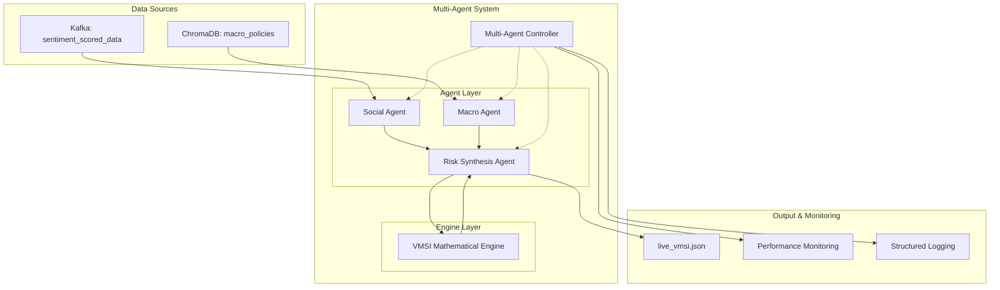

# Design Document

## Overview

The Multi-Agent System implements a distributed, fault-tolerant architecture for calculating the Vietnam Market Sentiment Index (VMSI) in real-time. This system orchestrates specialized agents using modern async patterns and robust error handling to process social media sentiment data and macroeconomic policies, producing reliable financial market indicators.

The system integrates social media sentiment analysis (via PhoBERT processing) with policy sentiment evaluation from central bank communications to generate a composite market sentiment index. It features comprehensive error handling, connection pooling, dead letter queues, and automated risk assessment with Vietnamese-language warnings for extreme market conditions.

### System Architecture Vision

The system follows a modular agent-based architecture where each agent has a specific responsibility:
- **VMSI_Engine**: Mathematical computation module implementing vectorized NumPy operations for sentiment index calculations with comprehensive validation
- **Social_Agent**: Asynchronous Kafka consumer agent processing PhoBERT sentiment data with connection pooling and dead letter queue management  
- **Macro_Agent**: ChromaDB semantic query agent with connection pooling, caching, and retry logic for policy sentiment analysis
- **Risk_Synthesis_Agent**: Central coordination agent implementing risk assessment, Vietnamese warning generation, and atomic file operations
- **MAC_System**: Multi-Agent Controller orchestrating agent lifecycles and workflow execution using deterministic routing

The design prioritizes reliability, performance, and maintainability by implementing circuit breaker patterns, exponential backoff retry strategies, and comprehensive error handling throughout the data pipeline.

## Architecture

### High-Level System Architecture


### Agent Communication Flow

The system implements a deterministic sequential workflow with the following data flow:

1. **Initialization Phase**: Multi-Agent Controller initializes all agents and validates external connections
2. **Data Acquisition Phase**: Social Agent consumes from Kafka, Macro Agent queries ChromaDB (parallel execution when possible)
3. **Processing Phase**: Both agents process data with comprehensive validation and error handling
4. **Synthesis Phase**: Risk Synthesis Agent receives results and orchestrates VMSI computation
5. **Output Phase**: System outputs results to JSON file with risk assessment and Vietnamese warnings

### Resilience and Fault Tolerance Patterns

The architecture implements comprehensive resilience patterns:
- **Circuit Breaker Pattern**: For external service calls (Kafka, ChromaDB) with configurable thresholds
- **Exponential Backoff with Jitter**: For retry mechanisms with configurable parameters
- **Dead Letter Queue**: For malformed or unparseable messages
- **Graceful Degradation**: System continues with cached/neutral values when components fail
- **Connection Pooling**: Managed connection pools with health monitoring for all external services
- **Atomic File Operations**: Backup creation and retry logic for reliable output generation

## Components and Interfaces

### 1. VMSI Mathematical Engine

**Purpose**: Pure computation engine implementing VMSI mathematical formulas with comprehensive validation

**Key Interfaces**:
```python
class VMSIEngine:
    def calculate_interaction_weight(self, likes: int, shares: int, comments: int) -> float
        """Calculate E_i = ln(1 + likes_i + shares_i + comments_i)"""
    
    def validate_inputs(self, phobert_scores: np.ndarray, credibility_factors: np.ndarray) -> None
        """Validate PhoBERT scores [-1, 1] and credibility [0.1, 1.0]"""
    
    def calculate_social_score(self, 
                              phobert_scores: np.ndarray,
                              interaction_weights: np.ndarray, 
                              credibility_factors: np.ndarray) -> float
        """Calculate S_social(t) = Σ(s_i × E_i × R_i) / Σ(E_i × R_i)"""
    
    def calculate_macro_score(self, s_nhnn: float, s_news: float) -> float
        """Calculate S_macro(t) = 0.7 × S_nhnn(t) + 0.3 × S_news(t)"""
    
    def validate_nhnn_score(self, s_nhnn: float) -> None
        """Validate S_nhnn is in discrete set {-1, 0, 1}"""
    
    def calculate_raw_index(self, s_macro: float, s_social: float) -> float
        """Calculate I_raw(t) = 0.6 × S_macro(t) + 0.4 × S_social(t)"""
    
    def calculate_final_vmsi(self, i_raw: float) -> float
        """Calculate VMSI(t) = 50 × (I_raw(t) + 1) with boundary handling"""
    
    def apply_ema_smoothing(self, current_vmsi: float, previous_vmsi: float) -> float
        """Apply VMSI_smoothed(t) = 0.2 × VMSI(t) + 0.8 × VMSI_smoothed(t-1)"""
    
    def validate_finite_values(self, *values: float) -> None
        """Validate all calculations produce finite floating-point values"""
```
**Implementation Details**:
- Uses numpy arrays for vectorized calculations with comprehensive input validation
- Implements boundary condition handling for negative raw index values
- Provides precise floating-point arithmetic with VMSICalculationError for non-finite results
- Logs calculation details at DEBUG level and final results at INFO level for audit traceability

### 2. Social Agent with Enhanced Kafka Integration

**Purpose**: Robust Kafka consumer for sentiment-scored social media data with advanced fault tolerance

**Key Interfaces**:
```python
class SocialAgent:
    def connect_to_kafka(self, config: KafkaConfig) -> None
        """Connect using confluent-kafka with connection pooling"""
    
    def consume_sentiment_data(self) -> Iterator[Dict[str, Any]]
        """Consume from sentiment_scored_data topic with offset management"""
    
    def implement_retry_strategy(self, max_retries: int = 5, base_delay: float = 1.0) -> None
        """Exponential backoff with jitter_factor=0.25"""
    
    def setup_dead_letter_queue(self) -> None
        """Configure DLQ for malformed/unparseable messages"""
    
    def extract_phobert_scores(self, message: Dict) -> Tuple[float, bool]
        """Extract and validate sentiment.label, sentiment.confidence to [-1, 1]"""
    
    def extract_interaction_metrics(self, message: Dict) -> Tuple[int, int, int]
        """Extract likes, shares, comments with non-negative validation"""
    
    def extract_credibility_factors(self, message: Dict) -> float
        """Extract credibility from metadata [0.1, 1.0], default 0.5"""
    
    def process_message_batch(self, batch_size: int = 100) -> List[ProcessedMessage]
        """Process messages in configurable batches with timeout controls"""
    
    def log_processing_statistics(self) -> None
        """Log throughput, error rates, consumer lag every 5 seconds"""
    
    def handle_connection_failure(self) -> None
        """Circuit breaker pattern with cached/neutral fallback values"""
```

**Integration Points**:
- Connects to existing Kafka infrastructure using `confluent-kafka` library
- Implements consumer group management with automatic rebalancing
- Dead Letter Queue topology for failed message isolation
- Circuit breaker pattern for connection failure protection

### 3. Macro Agent with Advanced ChromaDB Integration

**Purpose**: Semantic policy analysis with connection pooling and caching optimization

**Key Interfaces**:
```python
class MacroAgent:
    def setup_connection_pool(self, pool_size: int = 5) -> None
        """Managed ChromaDB connection pool with health monitoring"""
    
    def implement_query_caching(self, ttl: int = 300) -> None
        """Query result caching with configurable TTL"""
    
    def perform_semantic_search(self, similarity_threshold: float = 0.7, k: int = 5) -> List[Document]
        """Semantic similarity queries against macro_policies collection"""
    
    def analyze_policy_sentiment(self, documents: List[Document]) -> int
        """Vietnamese keyword-based analysis returning {-1, 0, 1}"""
    
    def generate_vietnamese_summary(self, analysis_results: Dict) -> str
        """Generate policy summaries with document count, similarity, confidence"""
    
    def handle_connection_failure(self) -> Tuple[int, str]
        """Fallback to cached results when ChromaDB unavailable"""
    
    def log_performance_metrics(self) -> None
        """Log cache hit rates, query times, connection health"""
    
    def handle_no_results(self) -> Tuple[int, str]
        """Return neutral score (0) with Vietnamese explanation"""
```

**Integration Points**:
- Connects to existing ChromaDB `macro_policies` collection
- Implements connection health monitoring with automatic failover
- Query performance optimization through intelligent caching
- Vietnamese language processing for policy document analysis
### 4. Risk Synthesis Agent with Automated Assessment

**Purpose**: Central coordination agent implementing risk assessment and atomic file operations

**Key Interfaces**:
```python
class RiskSynthesisAgent:
    def validate_social_input(self, social_score: float) -> None
        """Validate social scores with finite value checking"""
    
    def validate_macro_input(self, macro_score: float, metadata: Dict) -> None
        """Validate macro scores and policy metadata"""
    
    def coordinate_vmsi_calculation(self, social_data: Dict, macro_data: Dict) -> float
        """Orchestrate complete VMSI pipeline with VMSI_Engine"""
    
    def assess_risk_levels(self, vmsi_smoothed: float) -> str
        """Classify: ≤20 (extreme panic), ≥81 (extreme euphoria), normal (21-80)"""
    
    def generate_vietnamese_warnings(self, risk_level: str, vmsi_value: float) -> str
        """Generate risk warnings in Vietnamese for extreme conditions"""
    
    def save_atomic_json(self, results: Dict, max_retries: int = 3) -> None
        """Atomic file operations with backup creation and retry logic"""
    
    def validate_json_schema(self, output: Dict) -> None
        """Validate required fields: vmsi_value, timestamp, status, risk_warning, component_scores"""
    
    def include_processing_metadata(self, timing: Dict, sources: Dict) -> Dict
        """Include comprehensive metadata with timing and data source details"""
    
    def manage_ema_state(self, current_vmsi: float) -> float
        """State management for EMA smoothing across calculation cycles"""
    
    def handle_file_operation_error(self, error: Exception) -> None
        """Restore from backup and raise FileOperationError"""
```

**Risk Assessment Logic**:
- VMSI ≤ 20: Extreme panic conditions with Vietnamese risk warnings
- VMSI ≥ 81: Extreme euphoria conditions with Vietnamese risk warnings  
- 20 < VMSI < 81: Normal market conditions
- Automated Vietnamese warning generation for extreme scenarios

### 5. Multi-Agent System Orchestration

**Purpose**: Central orchestration system implementing deterministic workflow execution

**Key Interfaces**:
```python
class MultiAgentSystem:
    def execute_sequential_workflow(self) -> Dict[str, Any]
        """Deterministic execution: Social_Agent → Macro_Agent → Risk_Synthesis_Agent → Output"""
    
    def enforce_timeout_limits(self, timeout: int = 30) -> None
        """Configurable timeout limits with graceful degradation"""
    
    def implement_circuit_breakers(self) -> None
        """Circuit breaker patterns for Kafka, ChromaDB dependencies"""
    
    def provide_centralized_logging(self) -> None
        """Structured logging with agent names, operation types, timing"""
    
    def handle_recoverable_errors(self, error: Exception, agent: str) -> None
        """Retry logic with exponential backoff before workflow failure"""
    
    def monitor_agent_health(self) -> Dict[str, str]
        """Periodic status checks with automatic restart capabilities"""
    
    def graceful_shutdown(self) -> None
        """Proper cleanup of connections and resources"""
    
    def collect_workflow_metrics(self) -> Dict[str, float]
        """End-to-end processing time, success rates, error classifications"""
    
    def manage_configuration(self, env_params: Dict) -> None
        """Environment-based parameter loading with validation"""
    
    def implement_fallback_strategies(self) -> Dict[str, Any]
        """Cached data or neutral baseline values for workflow failures"""
```

## Data Models

### Input Data Models

**Social Media Message (from Kafka `sentiment_scored_data` topic)**:
```json
{
  "sentiment": {
    "label": "Positive|Negative|Neutral",
    "confidence": 0.85,
    "all_scores": [{"label": "Positive", "confidence": 0.85}]
  },
  "interactions": {
    "likes": 150,
    "shares": 23,
    "comments": 47
  },
  "metadata": {
    "source": "f319_data|fb_mock_data",
    "timestamp": "2024-01-15T10:30:00Z",
    "credibility_score": 0.7
  }
}
```
**Policy Document (from ChromaDB `macro_policies` collection)**:
```json
{
  "content": "Nội dung chính sách của Ngân hàng Nhà nước...",
  "metadata": {
    "doc_name": "nhnn_policy_2024_01.pdf",
    "upload_time": "2024-01-10T08:00:00Z",
    "chunk_id": "policy_001_chunk_01",
    "confidence": 0.82,
    "source": "nhnn_official"
  }
}
```

### Internal Data Models

**VMSI Calculation Pipeline Data**:
```python
@dataclass
class VMSICalculationData:
    # Input validation results
    phobert_scores_valid: bool
    credibility_factors_valid: bool
    interaction_weights: np.ndarray
    
    # Calculation components  
    s_social: float          # Social sentiment score
    s_nhnn: int              # NHNN policy score {-1, 0, 1}
    s_news: float           # News sentiment score
    s_macro: float          # Macro score (0.7 × S_nhnn + 0.3 × S_news)
    i_raw: float            # Raw index (0.6 × S_macro + 0.4 × S_social)
    vmsi_current: float     # Current VMSI (50 × (I_raw + 1))
    vmsi_smoothed: float    # EMA smoothed VMSI
    
    # Processing metadata
    processing_timestamp: datetime
    calculation_errors: List[str]
    intermediate_validations: Dict[str, bool]
```

### Output Data Models

**Live VMSI Output (`live_vmsi.json`)**:
```json
{
  "vmsi_value": 67.5,
  "timestamp": "2024-01-15T10:30:00Z",
  "status": "normal|risk_low|risk_high",
  "risk_warning": "Cảnh báo rủi ro thị trường...", 
  "component_scores": {
    "s_social": 0.15,
    "s_macro": 0.25,
    "s_nhnn": 1,
    "s_news": 0.3,
    "confidence": 0.78
  },
  "processing_metadata": {
    "processing_time_seconds": 8.2,
    "agent_versions": {
      "social_agent": "1.0.0",
      "macro_agent": "1.0.0", 
      "risk_synthesis_agent": "1.0.0",
      "vmsi_engine": "1.0.0"
    },
    "data_sources": {
      "kafka_messages_processed": 1247,
      "policies_analyzed": 5,
      "data_source_availability": {
        "kafka_healthy": true,
        "chromadb_healthy": true
      }
    },
    "calculation_details": {
      "ema_previous_value": 65.2,
      "raw_index_value": 0.35,
      "boundary_condition_applied": false
    }
  }
}
```

## Correctness Properties

*A property is a characteristic or behavior that should hold true across all valid executions of a system—essentially, a formal statement about what the system should do. Properties serve as the bridge between human-readable specifications and machine-verifiable correctness guarantees.*

Based on the prework analysis, the following properties have been identified as suitable for property-based testing. These properties focus on the mathematical engine, data processing logic, and agent coordination behaviors that exhibit meaningful variation across different inputs.
### Property 1: Interaction Weight Logarithmic Formula Correctness

*For any* non-negative integers likes, shares, and comments, the interaction weight calculation SHALL produce the exact result E_i = ln(1 + likes_i + shares_i + comments_i)

**Validates: Requirements 1.1**

### Property 2: Input Validation for PhoBERT Scores and Credibility Factors

*For any* input arrays, PhoBERT scores SHALL be validated within range [-1, 1] and credibility factors within range [0.1, 1.0], with appropriate validation errors for out-of-range values

**Validates: Requirements 1.2**

### Property 3: Social Score Weighted Average Calculation

*For any* valid arrays of PhoBERT scores, interaction weights, and credibility factors, the social score SHALL equal Σ(s_i × E_i × R_i) / Σ(E_i × R_i), with division by zero returning 0.0

**Validates: Requirements 1.3**

### Property 4: Macro Score Weighted Formula

*For any* valid S_nhnn and S_news values, the macro score calculation SHALL apply the exact weighted formula S_macro(t) = 0.7 × S_nhnn(t) + 0.3 × S_news(t)

**Validates: Requirements 1.4**

### Property 5: NHNN Score Discrete Set Validation

*For any* S_nhnn input value, the system SHALL validate that S_nhnn is exactly one of {-1, 0, 1} and reject any other values

**Validates: Requirements 1.5**

### Property 6: Raw Index Weighted Combination Formula

*For any* valid S_macro and S_social values, the raw index calculation SHALL apply the exact weighted formula I_raw(t) = 0.6 × S_macro(t) + 0.4 × S_social(t)

**Validates: Requirements 1.6**

### Property 7: VMSI Transformation and Boundary Condition Handling

*For any* raw index value I_raw(t), if I_raw(t) < -1 then VMSI SHALL equal 0, otherwise VMSI SHALL equal 50 × (I_raw(t) + 1)

**Validates: Requirements 1.7**

### Property 8: Exponential Moving Average Smoothing Formula

*For any* current VMSI and previous smoothed VMSI values, the smoothed result SHALL apply the exact formula VMSI_smoothed(t) = 0.2 × VMSI(t) + 0.8 × VMSI_smoothed(t-1)

**Validates: Requirements 1.8**

### Property 9: Finite Value Validation and Error Handling

*For any* intermediate calculation results, if non-finite values (NaN, infinity) are detected, the system SHALL raise VMSICalculationError

**Validates: Requirements 1.9**

### Property 10: Exponential Backoff Retry Pattern Validation

*For any* Kafka connection failure scenario, the retry delays SHALL follow the exponential backoff pattern with configurable base_delay, max_delay, and jitter_factor

**Validates: Requirements 2.3**

### Property 11: Dead Letter Queue Message Routing

*For any* malformed or unparseable JSON message, the Social Agent SHALL route the message to the Dead Letter Queue and continue processing

**Validates: Requirements 2.4**

### Property 12: PhoBERT Score Extraction and Validation

*For any* message with sentiment data, the Social Agent SHALL extract sentiment.label and sentiment.confidence, validate the structure, and convert to range [-1, 1]

**Validates: Requirements 2.5**

### Property 13: Interaction Metrics Extraction with Validation

*For any* message, the Social Agent SHALL extract likes, shares, comments with non-negative validation and apply default values of 0 for missing fields

**Validates: Requirements 2.6**

### Property 14: Credibility Factor Extraction with Range Validation

*For any* message metadata, the Social Agent SHALL extract credibility factors, validate range [0.1, 1.0], and apply default fallback of 0.5

**Validates: Requirements 2.7**
### Property 15: Semantic Search Threshold Behavior

*For any* similarity threshold configuration, the semantic search results SHALL return only documents with similarity scores at or above the threshold

**Validates: Requirements 3.3**

### Property 16: Document Retrieval Limiting

*For any* policy query, the system SHALL return at most k documents (default k=5) regardless of the number of qualifying documents

**Validates: Requirements 3.4**

### Property 17: Vietnamese Policy Sentiment Analysis Output

*For any* Vietnamese policy document content, the sentiment analysis SHALL return exactly one discrete score from the set {-1, 0, 1}

**Validates: Requirements 3.5, 3.6**

### Property 18: Vietnamese Language Summary Generation

*For any* policy analysis results, the Macro Agent SHALL generate summaries in Vietnamese language including document count, average similarity, and confidence metrics

**Validates: Requirements 3.7**

### Property 19: Social Score Input Validation

*For any* social score input to Risk Synthesis Agent, the system SHALL validate finite values and handle non-finite inputs with appropriate error handling

**Validates: Requirements 4.1**

### Property 20: Macro Score and Metadata Validation  

*For any* macro score and metadata input, the Risk Synthesis Agent SHALL validate data completeness and format correctness

**Validates: Requirements 4.2**

### Property 21: Complete VMSI Pipeline Coordination

*For any* valid social and macro inputs, the Risk Synthesis Agent SHALL successfully coordinate with VMSI_Engine to compute final index values through the complete mathematical pipeline

**Validates: Requirements 4.3**

### Property 22: Risk Level Classification Thresholds

*For any* VMSI smoothed value, the risk assessment SHALL classify as: ≤20 (extreme panic), ≥81 (extreme euphoria), or normal (21-80)

**Validates: Requirements 4.4**

### Property 23: Vietnamese Risk Warning Generation

*For any* extreme risk condition (VMSI ≤20 or ≥81), the system SHALL generate risk warnings in Vietnamese language

**Validates: Requirements 4.5**

### Property 24: Atomic File Operations with Backup and Retry

*For any* result data, the system SHALL perform atomic file writes with backup creation and implement retry logic up to 3 attempts

**Validates: Requirements 4.6**

### Property 25: JSON Schema Validation

*For any* output data, the JSON SHALL be valid and include all required fields: vmsi_value, timestamp, status, risk_warning, component_scores

**Validates: Requirements 4.7**

### Property 26: EMA State Management Across Cycles

*For any* sequence of VMSI calculations, the EMA state SHALL be properly maintained and applied across multiple calculation cycles

**Validates: Requirements 4.9**

### Property 27: File Operation Error Recovery

*For any* file write failure, the system SHALL restore from backup and raise FileOperationError with detailed context

**Validates: Requirements 4.10**

### Property 28: Agent Operation Timeout Enforcement

*For any* agent operation, if execution exceeds the configured timeout limit, the system SHALL implement graceful degradation

**Validates: Requirements 5.2**

### Property 29: Recoverable Error Retry Logic

*For any* recoverable error encountered by agents, the Multi-Agent System SHALL implement exponential backoff retry logic before declaring workflow failure

**Validates: Requirements 5.5**

### Property 30: Workflow Fallback Strategy Implementation

*For any* complete workflow failure, the system SHALL implement fallback strategies using cached data or neutral baseline values

**Validates: Requirements 5.10**
## Error Handling

### Comprehensive Error Management Strategy

The system implements a multi-layered error handling approach designed to maintain operational continuity while providing detailed diagnostics for troubleshooting and system improvement.

#### Error Classification Framework

**Transient Errors (Recoverable with Retry)**:
- Network connectivity issues (Kafka brokers, ChromaDB connections)
- Temporary service unavailability or resource contention
- Timeout exceptions from external services
- Message processing queue backlog

*Handling Strategy*: Exponential backoff retry with configurable parameters (max_retries=5, base_delay=1.0s, max_delay=60.0s, jitter_factor=0.25) and circuit breaker protection

**Data Quality Errors (Partially Recoverable)**:
- Invalid message formats from Kafka (malformed JSON, missing fields)
- Corrupted or incomplete policy documents from ChromaDB
- Invalid numerical values (NaN, infinity, out-of-range values)
- PhoBERT scores outside [-1, 1] range or credibility factors outside [0.1, 1.0]

*Handling Strategy*: Route to Dead Letter Queue, log detailed error context, skip problematic data, continue processing with remaining valid data

**System Integration Errors (Degraded Operation)**:
- Social Agent complete failure → Use last known social score or default to neutral (0)
- Macro Agent complete failure → Use neutral macro score (S_nhnn = 0)
- ChromaDB collection unavailable → Use cached policy results with TTL fallback
- Kafka topic unavailable → Use historical data if available within time window

*Handling Strategy*: Graceful degradation with fallback values, comprehensive logging, and detailed status reporting

**Critical System Errors (Emergency Shutdown)**:
- VMSI mathematical engine errors (array dimension mismatch, mathematical domain errors)
- Configuration validation failures during system initialization
- File system errors preventing JSON output generation
- Memory exhaustion or resource allocation failures
- Circuit breaker cascade failures across multiple services

*Handling Strategy*: Immediate graceful shutdown with state preservation, comprehensive error reporting, and operator alerting

### Circuit Breaker Implementation Details

The system implements circuit breaker patterns using configurable thresholds and recovery strategies:

```python
from utils.circuit_breaker import CircuitBreaker

# Kafka Circuit Breaker Configuration
kafka_breaker = CircuitBreaker(
    failure_threshold=5,     # Trip after 5 consecutive failures
    recovery_timeout=30,     # Attempt reset after 30 seconds
    expected_exception=(KafkaException, ConnectionError),
    half_open_max_calls=3    # Limited calls during recovery testing
)

# ChromaDB Circuit Breaker Configuration
chromadb_breaker = CircuitBreaker(
    failure_threshold=3,     # Trip after 3 consecutive failures  
    recovery_timeout=20,     # Attempt reset after 20 seconds
    expected_exception=(ConnectionError, TimeoutError),
    half_open_max_calls=2    # Limited calls during recovery testing
)
```

**Circuit Breaker States and Transitions**:

1. **Closed State (Normal Operation)**:
   - All requests pass through to external services
   - Failure counter increments on exceptions, resets on success
   - Monitor failure rate and consecutive failure patterns

2. **Open State (Service Protection)**:
   - All requests fail immediately without calling external service
   - Return cached data, neutral values, or raise ServiceUnavailableError
   - Significantly reduces system load and response latency

3. **Half-Open State (Recovery Testing)**:
   - Limited number of test requests (2-3) allowed through to external service
   - If test requests succeed, circuit transitions to Closed state
   - If test requests fail, circuit returns to Open state with extended timeout

### Logging and Monitoring Strategy

**Structured Logging with Contextual Information**:
```python
import structlog
from datetime import datetime

logger = structlog.get_logger()

# Example comprehensive log entry
logger.error(
    "vmsi_calculation_pipeline_failure",
    agent_name="risk_synthesis_agent",
    operation_id="vmsi_calc_20240115_103045",
    vmsi_raw_value=i_raw_value,
    error_type="mathematical_domain_error", 
    error_details=str(exception),
    stack_trace=traceback.format_exc(),
    processing_timestamp=datetime.utcnow().isoformat(),
    correlation_id=correlation_id,
    input_data_hash=hashlib.sha256(str(input_data).encode()).hexdigest()[:16],
    system_resources={
        "memory_usage_mb": psutil.virtual_memory().used // (1024*1024),
        "cpu_usage_percent": psutil.cpu_percent()
    }
)
```

**Performance and Health Metrics Collection**:
- End-to-end processing latency monitoring (target: ≤10 seconds)
- Agent-level execution time breakdown and bottleneck identification
- Message processing throughput rates (target: 1000 posts/minute capacity)
- Error frequency analysis and trend detection
- Circuit breaker state transitions and recovery patterns
- Resource utilization monitoring (memory, CPU, connection pools)

## Testing Strategy

### Comprehensive Testing Framework

The testing strategy combines multiple methodologies to ensure comprehensive coverage, system reliability, and mathematical correctness:

**1. Property-Based Testing (Primary Focus)**:
- **Framework**: Hypothesis 6.100+ for robust property-based testing
- **Mathematical Coverage**: VMSI formulas, input validation, data transformations
- **Agent Logic Coverage**: Message processing, error handling, state management
- **Configuration**: Minimum 100 iterations per property test with custom generators

**2. Unit Testing (Complementary Coverage)**:
- **Framework**: pytest 7.0+ with comprehensive fixtures and mocking
- **Component Isolation**: Individual agent testing with mocked dependencies
- **Edge Case Validation**: Boundary conditions, error scenarios, configuration edge cases
- **Mock Strategy**: Kafka (using embedded broker), ChromaDB (in-memory), external services

**3. Integration Testing (Infrastructure Validation)**:
- **Kafka Integration**: Embedded Kafka broker with real message processing
- **ChromaDB Integration**: In-memory ChromaDB with actual semantic search
- **End-to-End Workflows**: Complete pipeline testing with synthetic Vietnamese data
- **Performance Validation**: Throughput and latency benchmarking under load
### Property-Based Testing Implementation

**Test Configuration and Dependencies**:
```python
# Testing framework dependencies
pytest >= 7.0.0           # Test runner with advanced fixtures
hypothesis >= 6.100.0     # Property-based testing framework
pytest-asyncio >= 0.21.0  # Async agent testing support
freezegun >= 1.2.0        # Time mocking for reproducible tests
pytest-mock >= 3.10.0     # Enhanced mocking capabilities

# Test data generation
faker >= 18.0.0           # Synthetic data generation
hypothesis-vietnamese >= 1.0.0  # Vietnamese text generators (custom)
```

**Custom Generators for Financial and Vietnamese Data**:
```python
from hypothesis import given, strategies as st, settings
from hypothesis.extra.numpy import arrays
import numpy as np

@st.composite
def vietnamese_social_media_data(draw):
    """Generate realistic Vietnamese social media messages"""
    num_posts = draw(st.integers(min_value=1, max_value=1000))
    
    # PhoBERT sentiment scores [-1, 1]
    phobert_scores = draw(arrays(
        dtype=np.float32,
        shape=(num_posts,),
        elements=st.floats(min_value=-1.0, max_value=1.0, allow_nan=False)
    ))
    
    # Social media interaction metrics
    likes = draw(arrays(
        dtype=np.int32,
        shape=(num_posts,),
        elements=st.integers(min_value=0, max_value=50000)
    ))
    shares = draw(arrays(
        dtype=np.int32, 
        shape=(num_posts,),
        elements=st.integers(min_value=0, max_value=5000)
    ))
    comments = draw(arrays(
        dtype=np.int32,
        shape=(num_posts,),
        elements=st.integers(min_value=0, max_value=2000)
    ))
    
    # Credibility factors [0.1, 1.0]
    credibility = draw(arrays(
        dtype=np.float32,
        shape=(num_posts,),
        elements=st.floats(min_value=0.1, max_value=1.0, allow_nan=False)
    ))
    
    return phobert_scores, likes, shares, comments, credibility

@st.composite  
def nhnn_policy_documents(draw):
    """Generate realistic NHNN policy document data"""
    doc_count = draw(st.integers(min_value=1, max_value=10))
    
    policy_sentiments = draw(st.lists(
        st.sampled_from([-1, 0, 1]),  # Discrete NHNN scores
        min_size=doc_count,
        max_size=doc_count
    ))
    
    # Vietnamese policy text snippets
    vietnamese_content = draw(st.lists(
        st.text(
            alphabet="aăâbcdđeêfghijklmnoôơpqrstuưvwxyz AĂÂBCDĐEÊFGHIJKLMNOÔƠPQRSTUƯVWXYZ.,!?",
            min_size=100,
            max_size=1000
        ),
        min_size=doc_count,
        max_size=doc_count
    ))
    
    confidence_scores = draw(st.lists(
        st.floats(min_value=0.0, max_value=1.0, allow_nan=False),
        min_size=doc_count,
        max_size=doc_count  
    ))
    
    return policy_sentiments, vietnamese_content, confidence_scores

# Property test example with comprehensive tagging
@given(vietnamese_social_media_data())
@settings(max_examples=100, deadline=5000)  # 5 second timeout per test
def test_vmsi_social_score_mathematical_correctness(social_data):
    """
    Feature: multi-agent-system, Property 3: Social Score Weighted Average Calculation
    For any valid arrays of PhoBERT scores, interaction weights, and credibility factors,
    the social score SHALL equal Σ(s_i × E_i × R_i) / Σ(E_i × R_i), with division by zero returning 0.0
    """
    phobert_scores, likes, shares, comments, credibility = social_data
    
    # Initialize VMSI Engine
    engine = VMSIEngine()
    
    # Calculate interaction weights using logarithmic formula
    interaction_weights = np.log(1 + likes + shares + comments)
    
    # Execute social score calculation
    result = engine.calculate_social_score(
        phobert_scores, interaction_weights, credibility
    )
    
    # Manual verification of mathematical correctness
    numerator = np.sum(phobert_scores * interaction_weights * credibility)
    denominator = np.sum(interaction_weights * credibility)
    
    expected = numerator / denominator if denominator != 0 else 0.0
    
    # Assertions with appropriate tolerance
    assert np.isclose(result, expected, rtol=1e-6, atol=1e-10), \
        f"Social score calculation incorrect: {result} != {expected}"
    assert np.isfinite(result), "Social score must be finite"
    assert isinstance(result, float), "Social score must be float type"

@given(st.floats(min_value=-2.0, max_value=2.0, allow_nan=False),
       st.floats(min_value=-2.0, max_value=2.0, allow_nan=False))
@settings(max_examples=100)
def test_vmsi_raw_index_weighted_combination(s_macro, s_social):
    """
    Feature: multi-agent-system, Property 6: Raw Index Weighted Combination Formula
    For any valid S_macro and S_social values, the raw index calculation
    SHALL apply the exact weighted formula I_raw(t) = 0.6 × S_macro(t) + 0.4 × S_social(t)
    """
    engine = VMSIEngine()
    
    # Execute raw index calculation
    result = engine.calculate_raw_index(s_macro, s_social)
    
    # Verify exact mathematical formula
    expected = 0.6 * s_macro + 0.4 * s_social
    
    assert np.isclose(result, expected, rtol=1e-10), \
        f"Raw index formula incorrect: {result} != {expected}"
    assert np.isfinite(result), "Raw index must be finite"
```

### Integration Testing Strategy

**Embedded Service Testing with Real Data Flow**:
```python
import pytest
from testcontainers.kafka import KafkaContainer
from testcontainers.compose import DockerCompose
import chromadb

@pytest.fixture(scope="session")
def kafka_test_environment():
    """Set up embedded Kafka for integration testing"""
    with KafkaContainer() as kafka:
        # Pre-populate with Vietnamese test data
        producer = kafka.get_producer()
        test_messages = generate_vietnamese_test_messages(1000)
        
        for message in test_messages:
            producer.send("sentiment_scored_data", message)
        
        yield kafka

@pytest.fixture(scope="session")  
def chromadb_test_environment():
    """Set up in-memory ChromaDB with Vietnamese policy documents"""
    client = chromadb.Client()
    collection = client.create_collection("test_macro_policies")
    
    # Add Vietnamese policy documents for testing
    vietnamese_policies = load_vietnamese_test_policies()
    collection.add(
        documents=vietnamese_policies["content"],
        metadatas=vietnamese_policies["metadata"],
        ids=vietnamese_policies["ids"]
    )
    
    yield client, collection

def test_complete_vmsi_pipeline_with_vietnamese_data(kafka_test_environment, chromadb_test_environment):
    """Integration test for complete VMSI calculation with Vietnamese data"""
    
    # Initialize Multi-Agent System with test environments
    mac_system = MultiAgentSystem(
        kafka_config=kafka_test_environment.get_config(),
        chromadb_client=chromadb_test_environment[0],
        vietnamese_processing=True
    )
    
    # Execute complete workflow
    start_time = time.time()
    result = mac_system.execute_sequential_workflow()
    processing_time = time.time() - start_time
    
    # Verify performance requirements
    assert processing_time <= 10.0, f"Processing took {processing_time}s, should be ≤10s"
    
    # Verify output structure and content
    assert "vmsi_value" in result
    assert 0 <= result["vmsi_value"] <= 100
    assert result["status"] in ["normal", "risk_low", "risk_high"]
    assert "risk_warning" in result
    
    # Verify Vietnamese language content
    if result["vmsi_value"] <= 20 or result["vmsi_value"] >= 81:
        assert result["risk_warning"] is not None
        assert contains_vietnamese_text(result["risk_warning"])
    
    # Verify component scores
    assert "component_scores" in result
    assert "s_social" in result["component_scores"]
    assert "s_macro" in result["component_scores"]
    assert "s_nhnn" in result["component_scores"] 
    assert result["component_scores"]["s_nhnn"] in [-1, 0, 1]
```

### Performance and Load Testing

**Capacity and Throughput Validation**:
```python
def test_throughput_capacity_1000_posts_per_minute():
    """Validate system handles 1000 posts/minute processing capacity"""
    mac_system = MultiAgentSystem()
    
    # Generate 1000 realistic Vietnamese test messages
    test_messages = generate_vietnamese_social_media_messages(1000)
    
    start_time = time.time()
    
    # Process all messages through complete pipeline
    results = []
    for message in test_messages:
        result = mac_system.process_single_message(message)
        results.append(result)
    
    total_time = time.time() - start_time
    
    # Verify throughput requirement
    assert total_time <= 60, f"Processing 1000 posts took {total_time}s, should be ≤60s"
    
    # Verify all results are valid
    for result in results:
        assert 0 <= result["vmsi_value"] <= 100
        assert np.isfinite(result["vmsi_value"])

def test_memory_usage_under_load():
    """Validate memory usage stays within acceptable limits"""
    import psutil
    import gc
    
    mac_system = MultiAgentSystem()
    
    initial_memory = psutil.virtual_memory().used
    
    # Process large batch to test memory management
    for batch_num in range(100):  # 100 batches of 100 messages each
        batch_messages = generate_vietnamese_social_media_messages(100)
        mac_system.process_message_batch(batch_messages)
        
        # Force garbage collection
        gc.collect()
        
        current_memory = psutil.virtual_memory().used
        memory_increase_mb = (current_memory - initial_memory) / (1024 * 1024)
        
        # Memory should not increase significantly
        assert memory_increase_mb < 100, f"Memory increased by {memory_increase_mb}MB"

def test_concurrent_agent_processing():
    """Test parallel processing capabilities of Social and Macro agents"""
    import asyncio
    
    async def test_concurrent_execution():
        mac_system = MultiAgentSystem()
        
        # Start both agents concurrently
        social_task = asyncio.create_task(mac_system.social_agent.process_batch())
        macro_task = asyncio.create_task(mac_system.macro_agent.analyze_policies())
        
        start_time = time.time()
        social_result, macro_result = await asyncio.gather(social_task, macro_task)
        concurrent_time = time.time() - start_time
        
        # Should be faster than sequential execution
        sequential_time = test_sequential_execution_time()
        assert concurrent_time < sequential_time * 0.8, "Concurrent execution should be significantly faster"
    
    asyncio.run(test_concurrent_execution())
```