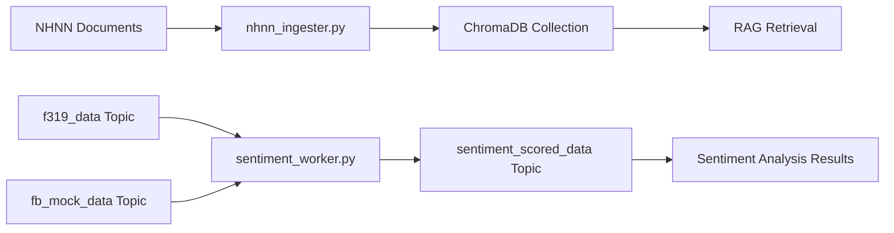

# NLP Engine for FinSent-Agent

Hệ thống Xử lý Ngôn ngữ Tự nhiên (NLP Engine) và Kho tri thức (Vector DB) cho dự án FinSent-Agent.

## Cấu Trúc Hệ Thống

```
nlp_engine/
├── .env.example           # Template cấu hình
├── requirements.txt       # Python dependencies
├── setup_nlp.py          # Setup script tự động
├── test_nlp_system.py     # Test toàn bộ hệ thống
├── nhnn_ingester.py       # Module 1: RAG Data Ingestion
├── sentiment_worker.py    # Module 2: PhoBERT Sentiment Worker
├── nhnn_docs/             # Thư mục chứa tài liệu NHNN
│   ├── pdf/               # File PDF
│   ├── docx/              # File Word
│   └── txt/               # File text
└── README.md              # Documentation này
```

## Module 1: RAG Data Ingestion (Trạm nạp tài liệu NHNN)

### Mô Tả
Script `nhnn_ingester.py` sử dụng LangChain và ChromaDB để xử lý tài liệu NHNN.

### Tính Năng
- **File Monitoring**: Lắng nghe thư mục `nhnn_docs/` tự động
- **Multi-format Support**: Xử lý PDF, Word (.docx), và Text files
- **Intelligent Chunking**: Chia văn bản với `chunk_size=1000`, `chunk_overlap=200`
- **Vietnamese Embeddings**: Sử dụng model sentence-transformers cho tiếng Việt
- **Metadata Standard**: JSON format chuẩn với `doc_name`, `upload_time`, `chunk_id`
- **Vector Storage**: Lưu vào ChromaDB collection `macro_policies`

### Cấu Hình
```bash
# ChromaDB Configuration
AWS_CHROMA_HOST=your-ec2-ip:8000
NHNN_DOCS_DIR=nhnn_docs
COLLECTION_NAME=macro_policies
CHUNK_SIZE=1000
CHUNK_OVERLAP=200
```

### Metadata Format
```json
{
  "doc_name": "thong_tu_01_2024.pdf",
  "upload_time": "2024-01-15T10:30:00+00:00", 
  "chunk_id": "thong_tu_01_2024_0_5_1705315800",
  "file_path": "/path/to/document.pdf",
  "file_size": 2048576,
  "file_extension": ".pdf",
  "processing_timestamp": "2024-01-15T10:31:00+00:00"
}
```

### Cách Sử Dụng

**Quét và xử lý tất cả tài liệu:**
```bash
python nhnn_ingester.py --mode scan
```

**Theo dõi thư mục (auto-process):**
```bash
python nhnn_ingester.py --mode watch
```

**Xem thống kê collection:**
```bash
python nhnn_ingester.py --mode stats
```

**Tìm kiếm tài liệu:**
```bash
python nhnn_ingester.py --mode search --query "chính sách tiền tệ" --limit 5
```

## Module 2: PhoBERT Sentiment Worker (Công nhân khử nhiễu)

### Mô Tả
Script `sentiment_worker.py` là Kafka Consumer + Producer với PhoBERT sentiment analysis.

### Tính Năng
- **Multi-Topic Consumer**: Đọc từ `f319_data` và `fb_mock_data` topics
- **Vietnamese Sentiment**: Sử dụng PhoBERT hoặc Vietnamese-specific models
- **3-Class Classification**: Positive, Neutral, Negative
- **Real-time Processing**: Stream processing với Kafka
- **Enhanced Messages**: Thêm sentiment scores vào original data
- **Fallback Models**: Auto-fallback nếu Vietnamese model không có

### Cấu Hình
```bash
# Kafka Configuration
AWS_KAFKA_BROKER=your-ec2-ip:9092

# Model Configuration
PHOBERT_MODEL=vinai/phobert-base-v2
SENTIMENT_MODEL=uitnlp/vietnamese-sentiment
```

### Input Topics
1. **f319_data**: Forum posts từ F319
2. **fb_mock_data**: Mock Facebook comments

### Output Format
```json
{
  "comment_id": "fb_001",
  "content_text": "Thị trường hôm nay tích cực!",
  "created_at": "2024-01-15T09:30:00+00:00",
  "likes": 15,
  "sentiment": {
    "label": "Positive",
    "confidence": 0.89,
    "all_scores": [
      {"label": "Positive", "confidence": 0.89},
      {"label": "Neutral", "confidence": 0.08},
      {"label": "Negative", "confidence": 0.03}
    ],
    "model_type": "vietnamese"
  },
  "processing": {
    "source_topic": "fb_mock_data",
    "processed_at": "2024-01-15T16:00:00+00:00",
    "worker_id": "sentiment_worker_1705315800",
    "text_length": 28,
    "processing_version": "1.0"
  }
}
```

### Cách Sử Dụng

**Chạy sentiment worker:**
```bash
python sentiment_worker.py --mode run
```

**Health check:**
```bash
python sentiment_worker.py --mode health
```

**Test sentiment analysis:**
```bash
python sentiment_worker.py --mode test --test-text "Thị trường tăng mạnh hôm nay!"
```

## Cài Đặt

### 1. Automated Setup (Khuyến nghị)
```bash
cd nlp_engine
python setup_nlp.py
```

### 2. Manual Setup
```bash
cd nlp_engine

# Install dependencies
pip install -r requirements.txt

# Create directories
mkdir -p nhnn_docs/{pdf,docx,txt}

# Setup environment
cp .env.example .env
# Edit .env with your configuration
```

### 3. Cấu hình Environment
```bash
# Copy và chỉnh sửa .env
cp .env.example .env

# Cập nhật các giá trị:
AWS_CHROMA_HOST=your-ec2-ip:8000
AWS_KAFKA_BROKER=your-ec2-ip:9092
```

## Testing

### Comprehensive System Test
```bash
python test_nlp_system.py
```

Test này sẽ kiểm tra:
- ✅ ChromaDB connection
- ✅ Document processing và chunking
- ✅ Search functionality
- ✅ Sentiment model loading
- ✅ Message format compatibility
- ✅ System integration

### Individual Tests

**Test Document Ingester:**
```bash
python nhnn_ingester.py --mode stats
```

**Test Sentiment Worker:**
```bash
python sentiment_worker.py --mode health
```

## Kiến Trúc Data Flow



## Kafka Topics

### Input Topics (Consumed by sentiment_worker)
1. **f319_data**: Forum posts từ F319 scraper
2. **fb_mock_data**: Mock Facebook comments

### Output Topic (Produced by sentiment_worker)
1. **sentiment_scored_data**: Enhanced messages với sentiment scores

## ChromaDB Collections

### macro_policies Collection
- **Purpose**: Lưu trữ tài liệu NHNN đã được chunked
- **Embeddings**: Vietnamese sentence-transformers model
- **Metadata**: JSON format chuẩn theo yêu cầu
- **Search**: Vector similarity search

## Models Used

### Embeddings (Document Ingester)
1. **Primary**: `keepitreal/vietnamese-sbert` (Vietnamese)
2. **Fallback**: `sentence-transformers/all-MiniLM-L6-v2` (Multilingual)

### Sentiment Analysis (Sentiment Worker)
1. **Primary**: `uitnlp/vietnamese-sentiment` (Vietnamese)
2. **Fallback**: `cardiffnlp/twitter-roberta-base-sentiment-latest` (Multilingual)
3. **Basic**: Default transformer sentiment model

## Performance & Monitoring

### Document Ingester Stats
```json
{
  "collection_name": "macro_policies",
  "document_count": 1250,
  "processed_files_count": 45,
  "chroma_host": "your-ec2-ip:8000"
}
```

### Sentiment Worker Stats
```json
{
  "runtime_seconds": 3600,
  "messages_processed": 1420,
  "messages_sent": 1418,
  "errors": 2,
  "messages_per_second": 0.39,
  "model_type": "vietnamese"
}
```

## Troubleshooting

### Common Issues

**1. ChromaDB Connection Failed**
```
Error: Failed to connect to ChromaDB
```
- Verify `AWS_CHROMA_HOST` in .env
- Check if ChromaDB service is running on port 8000
- Test: `curl http://your-ec2-ip:8000/api/v1/heartbeat`

**2. Kafka Connection Issues**
```
Error: No Kafka brokers available
```
- Verify `AWS_KAFKA_BROKER` in .env
- Check Kafka service on port 9092
- Verify topics exist: `f319_data`, `fb_mock_data`

**3. Model Loading Errors**
```
Error: Failed to load Vietnamese model
```
- Internet connection required for first download
- Models cache in ~/.cache/huggingface/
- Fallback models will be used automatically

**4. Document Processing Errors**
```
Error: No content loaded from document
```
- Check file format (PDF, DOCX, TXT supported)
- Verify file is not corrupted
- Check file permissions

### Debug Commands

**Check ChromaDB:**
```bash
curl http://your-ec2-ip:8000/api/v1/heartbeat
```

**Test Kafka connection:**
```bash
kafka-topics.sh --bootstrap-server your-ec2-ip:9092 --list
```

**Check document processing:**
```bash
python nhnn_ingester.py --mode stats
```

**Monitor sentiment worker:**
```bash
python sentiment_worker.py --mode health
```

## Development Notes

### Metadata Requirements
- **Strict JSON format**: Không được dùng JSONL
- **Required fields**: `doc_name`, `upload_time`, `chunk_id`
- **Serializable types**: str, int, float, bool only
- **No nested objects**: Flatten complex structures

### Performance Considerations
- **Batch processing**: 10 documents per batch default
- **Memory management**: Models load on CPU by default
- **Chunking strategy**: Recursive character splitting
- **Concurrent processing**: Thread-safe operations

### Extensibility
- **New document types**: Add loaders in `_load_document()`
- **Custom embeddings**: Replace model in `_setup_embeddings()`
- **Additional metadata**: Extend `_create_chunk_metadata()`
- **New sentiment models**: Update model config in `_setup_sentiment_models()`

## Production Deployment

### Docker Configuration
```dockerfile
FROM python:3.9-slim

WORKDIR /app
COPY requirements.txt .
RUN pip install -r requirements.txt

COPY . .
CMD ["python", "sentiment_worker.py", "--mode", "run"]
```

### Environment Variables
```bash
# Production settings
AWS_CHROMA_HOST=prod-chroma:8000
AWS_KAFKA_BROKER=prod-kafka:9092
BATCH_SIZE=20
PROCESSING_DELAY=1
```

### Monitoring
- Health check endpoints
- Processing statistics
- Error rates và retry logic
- Resource usage monitoring

Chúc bạn thành công với FinSent-Agent NLP Engine! 🚀